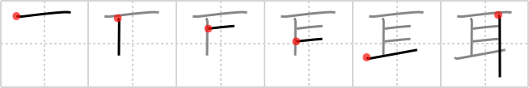

## `ear`

## [6]

## Reading:

### On-Yomi: ジ &mdash; Kun-Yomi: みみ

## Heisig V6:

The pictograph for the <b>ear</b> looks much like that for <i>eye</i>, but note how the stroke order gives it a different look.

## Koohii stories:

1) [<a href="http://kanji.koohii.com/profile/brian44">brian44</a>] 14-11-2007(87): Your<strong> ear</strong> is like the eye on the side of your head for seeing things, but there is hair around it that creates jagged lines.

2) [<a href="http://kanji.koohii.com/profile/delbertmon">delbertmon</a>] 30-11-2009(39): Just remember it.

3) [<a href="http://kanji.koohii.com/profile/fuaburisu">fuaburisu</a>] 10-10-2005(36): Pictograph, see book. * The primitive meaning can easily be extended to<strong> ear</strong> plugs.

4) [<a href="http://kanji.koohii.com/profile/andresito">andresito</a>] 9-5-2009(20): Deaf people use their<strong> ear</strong>s as <em>eyes</em>. An<strong> ear</strong> is just a modified <em>eye</em>.

5) [<a href="http://kanji.koohii.com/profile/DavidZ">DavidZ</a>] 29-12-2009(12): Correct stroke order: Begin with capital T, add two horizontals from capital F. Then add the &quot;scissors&quot; from 斗 <a href="../1177">Big Dipper</a> (#1177 斗)... Remember: the horizontals overextend at all 4 corners, but the verticals overextend ONLY at the bottom right corner... 耳 [みみ].

6) [<a href="http://kanji.koohii.com/profile/harusame">harusame</a>] 23-5-2009(3): If you go out <em>sideways</em> from your <em>eyes</em> (much like these strokes), you&#039;ll find your<strong> ear</strong>s.

7) [<a href="http://kanji.koohii.com/profile/QuantumSquirrel">QuantumSquirrel</a>] 12-2-2009(3): ジ, みみ.

8) [<a href="http://kanji.koohii.com/profile/shadolite">shadolite</a>] 15-5-2008(2): My eyes stretch waaay out to my<strong> ear</strong>s.

9) [<a href="http://kanji.koohii.com/profile/jbudding">jbudding</a>] 5-5-2013(1): A bat uses its<strong> EAR</strong> like an <em>eye</em> with flaps for catching sound.

10) [<a href="http://kanji.koohii.com/profile/Cormbit">Cormbit</a>] 5-9-2012(1): <strong>Ear</strong>s are literally very similar to <em>eyes</em> in function, but are surrounded by <em>hair</em>.
