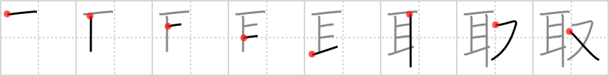

# {取}

## `take`

## Strokes: 8

## Reading:

### On-Yomi: シュ &mdash; Kun-Yomi: と.る、と.り、と.り-、とり、-ど.り

### Examples: 取る (と.る)

## Words:

受け取り(うけとり): receipt

書き取り(かきとり): dictation

書き取る(かきとる): to write down, to take dictation, to take notes

聞き取り(ききとり): listening comprehension

下取り(したどり): trade in, part exchange

取材(しゅざい): choice of subject, collecting data

塵取り(ちりとり): dustpan

取っ手(とって): handle, grip, knob

取りあえず(とりあえず): at once, first of all, for the time being

取り扱い(とりあつかい): treatment, service, handling, management

取り扱う(とりあつかう): to treat, to handle, to deal in

取り替え(とりかえ): swap, exchange

取り組む(とりくむ): to tackle, to wrestle with, to engage in a bout, to come to grips with

取り締まり(とりしまり): control, management, supervision

取り締まる(とりしまる): to manage, to control, to supervise

取り調べる(とりしらべる): to investigate, to examine

取り立てる(とりたてる): to collect, to extort, to appoint, to promote

取り次ぐ(とりつぐ): to act as an agent for, to announce (someone), to convey (a message)

取り除く(とりのぞく): to remove, to take away, to set apart

取り引き(とりひき): transactions, dealings, business

取り巻く(とりまく): to surround, to circle, to enclose

取り混ぜる(とりまぜる): to mix, to put together

取り戻す(とりもどす): to take back, to regain

取り寄せる(とりよせる): to order, to send away for

取り分(とりわけ): especially, above all

乗っ取る(のっとる): to capture, to occupy, to usurp

引き取る(ひきとる): to take charge of, to take over, to retire to a private place

日取り(ひどり): fixed date, appointed day

受け取る(うけとる): to receive, to get, to accept, to take, to interpret, to understand

取り上げる(とりあげる): take up, pick up, disqualify, confiscate, deprive

取り入れる(とりいれる): harvest, take in, adopt

取り消す(とりけす): cancel

取り出す(とりだす): take out, produce, pick out

取れる(とれる): come off, be taken off, be removed, be obtained, leave, come out (e.g. photo), be interpreted

取り替える(とりかえる): exchange

取る(とる): take, pick up, harvest, earn, choose
