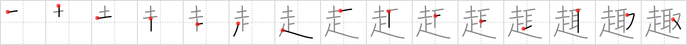

# {趣}

## `gist`

## Strokes: 15

## Reading:

### On-Yomi: シュ &mdash; Kun-Yomi: おもむき、おもむ.く

### Examples: 趣 (おもむき)

## Words:

趣(おもむき): meaning, tenor, gist, effect, appearance, taste, grace, charm, refinement

趣旨(しゅし): object, meaning

趣味(しゅみ): hobby
