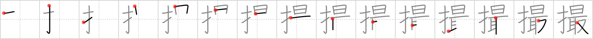

## `snapshot`

## [15]

## Reading:

### On-Yomi: サツ &mdash; Kun-Yomi: と.る、つま.む、-ど.り

## Heisig story:

<i>Finger</i> . . . <i>utmost</i>. This character <i>is</i> used for taking photographs. Note how, conveniently, the element for &quot;<i>take</i>&quot; is included in it.

## Koohii stories:

1) [<a href="http://kanji.koohii.com/profile/volfy">volfy</a>] 27-3-2006(308): Take the <em>utmost</em> care that you don&#039;t have your <em>finger</em> in the way when you take a<strong> snapshot</strong>.

2) [<a href="http://kanji.koohii.com/profile/astridtops">astridtops</a>] 19-6-2006(69): When I learned photography from my dad as a little girl, he explained the basics to me: &quot;when you <em>take</em> a<strong> snapshot</strong>, be careful not to put your <em>fingers</em> before the lens, and don&#039;t look towards the <em>sun</em> (this was in the days that photographs would be spoiled by direct sunlight).

3) [<a href="http://kanji.koohii.com/profile/Hujis">Hujis</a>] 26-12-2008(63): As a Japanese girl, when having your<strong> snapshot</strong> taken it is of the <em>utmost</em> importance to make the peace sign with your <em>fingers</em>.

4) [<a href="http://kanji.koohii.com/profile/cangy">cangy</a>] 18-1-2008(22): Pictograph of a large SLR, finger grip on the side, flash on top, and the bit that takes the<strong> snapshot</strong> underneath.

5) [<a href="http://kanji.koohii.com/profile/Francois">Francois</a>] 24-6-2008(20): When taking a<strong> snapshot</strong>, 1. Don&#039;t put FINGER on lens 2. Don&#039;t look into SUN 3. TAKE it!

6) [<a href="http://kanji.koohii.com/profile/g33kette">g33kette</a>] 1-4-2008(7): Giving the <em>finger</em> in a<strong> snapshot</strong> is of <em>utmost</em> importance if you want to prove how &quot;random&quot; and &quot;funny&quot; you are.

7) [<a href="http://kanji.koohii.com/profile/wazzab">wazzab</a>] 18-9-2006(6): The <em>utmost</em> control with a steady <em>finger</em> is needed to take a good<strong> snapshot</strong>.

8) [<a href="http://kanji.koohii.com/profile/LukeAmadeus">LukeAmadeus</a>] 26-3-2013(3): When you take a<strong> snapshot</strong>, making sure you don&#039;t have your <em>finger</em> in the way is of the <em>utmost</em> importance.

9) [<a href="http://kanji.koohii.com/profile/childofthetao">childofthetao</a>] 2-7-2011(3): You press the button with your <em>finger</em>, there is a flash of light as bright as the <em>sun</em>, then you <em>take</em> your photo from the camera. You see that extra long line? That&#039;s your photo sticking out of the camera.

10) [<a href="http://kanji.koohii.com/profile/howdycowdy">howdycowdy</a>] 22-4-2008(3): Peewee Herman tried his <em>utmost</em> to avoid being seen while he was <em>fingering</em> himself in the movie theater, but someone got a<strong> SNAPSHOT</strong> of him and his career was ruined.
