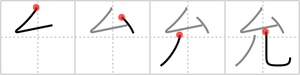

## `license`

## [4]

## Reading:

### On-Yomi: イン &mdash; Kun-Yomi: じょう、まこと.に、ゆるす

## Heisig story:

Elbow . . . human legs.

## Koohii stories:

1) [<a href="http://kanji.koohii.com/profile/fuaburisu">fuaburisu</a>] 21-10-2005(237): In some Asian kung-fu version of James Bond, the main protagonist has a “License To Kill” with his deadly <em>elbows</em> and <em>human legs</em>. His suit is always stained of red blood at the <em>elbows</em> and <em>lower legs</em> (this to help create an image that distinguish the two elements).

2) [<a href="http://kanji.koohii.com/profile/chamcham">chamcham</a>] 12-9-2008(82): A midget driver trying to pass the road test to get their driver&#039;s<strong> license</strong>. Their <em>elbows</em> are too short to turn the wheel and their <em>legs</em> are too short to reach the gas and breaks.

3) [<a href="http://kanji.koohii.com/profile/mazterdeath">mazterdeath</a>] 14-2-2008(78): You need a <strong>license</strong> to show your <em>elbows</em> and <em>legs</em> in mid east countries.

4) [<a href="http://kanji.koohii.com/profile/rtkrtk">rtkrtk</a>] 7-1-2008(44): To apply for your drivers<strong> license</strong> in Japan, you have to fill out lots of forms at standing-only counters. This kanji is a pictograph of you standing at the counter filling out the forms for your driver&#039;s<strong> license</strong>. Your <em>elbow</em> is bent, writing the necessary information on the form (in kanji, of course!); your <em>human legs</em> are getting tired from standing. Why can&#039;t they provide chairs and desks?

5) [<a href="http://kanji.koohii.com/profile/Oyabecory">Oyabecory</a>] 6-4-2013(24): She did not pass her driver&#039;s <strong>license</strong> test: she steered with her <em>elbows</em> while texting and then with her <em>legs</em> while putting on make-up.

6) [<a href="http://kanji.koohii.com/profile/MRT88">MRT88</a>] 1-12-2009(17): Hey! do you have a<strong> license</strong> to take away the top hats allotted to infants???

7) [<a href="http://kanji.koohii.com/profile/shuusaku">shuusaku</a>] 9-1-2013(8): It seems that Chuck Norris doesn&#039;t have the<strong> LICENSE</strong> to use his <em>ELBOWS</em> to fight. He is forced to use his <em>HUMAN LEGS</em> for roundabout kicks.

8) [<a href="http://kanji.koohii.com/profile/blaked569">blaked569</a>] 8-2-2009(7): Try this. Play Goldeneye (N64) on<strong> License</strong> to Kill difficulty, and kill enemies using only melee attacks. Yknow, with your <em>elbows</em> and <em>legs</em>.

9) [<a href="http://kanji.koohii.com/profile/ruisu">ruisu</a>] 14-11-2007(6): Logogram of Fred Flinstone in his car, pedaling away with his <em>elbow</em> hanging out the window after his got his drivers<strong> license</strong>.

10) [<a href="http://kanji.koohii.com/profile/tritonxg">tritonxg</a>] 7-1-2010(5): [FR]<strong>licence</strong> pas de Japlt <strong>IN makoto(ni) jô</strong> pas de k&amp;k <em> coude+jambes </em><strong>licence to kill james bond 007 :</strong> il ne faut pas viser le COUDE ou les JAMBES mais en plein dans le mille 允可 【いんか】 permission 允文允武 【いんぶにんぶ】 be versed in literary and military arts 承允 【しょういん】 acceptance;agreement 允許 【いんきょ】permission; <strong>licence</strong>.

### {V4: 765, V6: 827}
