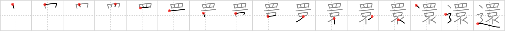

## `send back`

## [16]

## Reading:

### On-Yomi: カン &mdash; Kun-Yomi: かえ.る

## Words:

還元(かんげん): resolution, reduction, return to origins

還暦(かんれき): 60th birthday

返還(へんかん): return, restoration

## Koohii stories:

1) [<a href="http://kanji.koohii.com/profile/fuaburisu">fuaburisu</a>] 20-1-2006(234): You&#039;ve probably guessed it by now, this is the <em>road</em> that Sam and Frodo take to<strong> send back</strong> the <em>ring</em> to Mount Doom! (see previous frame, the <em>jewel</em> is replaced by the <em>road</em>). 

2) [<a href="http://kanji.koohii.com/profile/meolox">meolox</a>] 15-12-2007(110): Continued from <a href="../836">ring</a> (#836 <a href="http://jisho.org/kanji/details/環">環</a>)....... So I&#039;m on the <em>road</em> going to <strong>send back</strong> the <em>ring</em> minus the <em>jewel</em>, the hit to the floor knocked it out. 

3) [<a href="http://kanji.koohii.com/profile/Thora">Thora</a>] 3-2-2008(36): A <a href="../836">ring</a> (#836 <a href="http://jisho.org/kanji/details/環">環</a>) with no <em>jewel</em>?! she screamed and told her fiance to hit the <em>road</em> - she&#039;d<strong> send back</strong> the ring. 

4) [<a href="http://kanji.koohii.com/profile/saranich">saranich</a>] 19-11-2006(30): The Saudi woman was tired of looking at the floor and covering her mouth with a scarf, so she asked her husband to send her back on the road to home, though she didn&#039;t<strong> send back</strong> the ring. 

5) [<a href="http://kanji.koohii.com/profile/ashman63">ashman63</a>] 4-5-2008(6): This shows the <em>road</em> travelled by Frodo in the Lord of the Rings to<strong> send back</strong> the <em>One</em> ring to the <em>mouth</em> of Mordor...wrapped delicately in a <em>silk scarf</em>, of course. All the while, the <em>eye</em> of Sauron looks on. 

6) [<a href="http://kanji.koohii.com/profile/johngwk">johngwk</a>] 6-9-2010(5): See Ring story. Seeing how your potential fiance reacts to the jeweled ring, you decide not to marry her. She decides she wants the ring after all but seeing as she had such a negative first reaction to the jewel on it, you give her the ring minus the jewel before you send her back where she came from. A love story gone bad. 

7) [<a href="http://kanji.koohii.com/profile/crystalcastlecreature">crystalcastlecreature</a>] 7-8-2008(5): That annoying little girl again, &quot;EYE dont ONEt (want) it! <strong>SEND</strong> it <strong>BACK</strong>!! Or throw it on the ROAD!&quot; Her big MOUTH said in her expensive SCARF. 

8) [<a href="http://kanji.koohii.com/profile/robertmyers">robertmyers</a>] 3-4-2009(4): Continued from the prior kanji, here we see that the police showed up just in time scare off the thief and send him back on the road he came in on. Fortunately, the camera is still on and we see the shop keeper is safe and well. 

9) [<a href="http://kanji.koohii.com/profile/Unexpected">Unexpected</a>] 6-7-2012(3): Continuing my story for the previous Kanji, &quot;ring&quot;: <a href="../836">../836</a> Someone liked the king&#039;s idea and put the same laser-firing eyes system on his road. Now it&#039;s very peaceful there because all the cars who try to tresspass are <em>sent back</em> by the lasers. 

10) [<a href="http://kanji.koohii.com/profile/kakashi">kakashi</a>] 25-5-2011(2): Frodo and Sam go on the <em>road</em> to<strong> send back</strong> the ring. The entire time, Sauron&#039;s <em>eye</em> is watching them,above the <em>ceiling</em> of the tower. Their mouths are kept warm, at least, by the <em>scarves</em> around their necks. 
