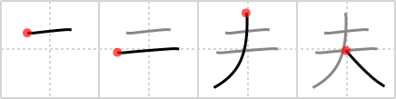

## `husband`

## [4]

## Reading:

### On-Yomi: フ、フウ、ブ &mdash; Kun-Yomi: おっと、そ.れ

## Heisig V6:

The kanji for <i>a</i> <b>husband</b> or &quot;head of the family&quot; is based on the kanji for <i>large</i> and an extra line near the top for the &quot;head.&quot; Recall the kanji for <i>heavens</i>&nbsp;already learned back in frame 457, and be sure to keep your story for this kanji different.

## Koohii stories:

1) [<a href="http://kanji.koohii.com/profile/synewave">synewave</a>] 15-10-2006(233): Even though it is argued size is not important, I&#039;m sure most women would like their<strong> husband</strong> to have a <em>big one</em>.

2) [<a href="http://kanji.koohii.com/profile/daredawg3583">daredawg3583</a>] 25-2-2007(72): Homer Simpson, as a primitive.

3) [<a href="http://kanji.koohii.com/profile/Clint">Clint</a>] 22-10-2008(21): After marriage, most men let themselves go a bit, and the result is predictable: <em>one large</em><strong> husband</strong>.

4) [<a href="http://kanji.koohii.com/profile/CharleyGarrett">CharleyGarrett</a>] 9-6-2006(18): My <em>husband</em> is sent from <strong>heaven</strong>, and his head still pokes out a little.

5) [<a href="http://kanji.koohii.com/profile/gavmck">gavmck</a>] 10-12-2009(7): The bride of Frankenstein owns this kanji. It represents her<strong> husband</strong>: <em>large</em> with a long <em>bolt</em> through his neck.

6) [<a href="http://kanji.koohii.com/profile/shirish">shirish</a>] 30-12-2008(5): Hunbands think they go <strong>beyond</strong> <em>heavens</em>.

7) [<a href="http://kanji.koohii.com/profile/jonusbalonus">jonusbalonus</a>] 17-4-2013(3): <strong>Husband</strong> of Marge, <em>Homer Simpson</em> is the nominal head of the family but you can see from the kanji that his empty head is nowhere near as <em>large</em> as his belly. <em>Homer Simpson</em> is the primitive for<strong> husband</strong> (thanks daredawg3583).

8) [<a href="http://kanji.koohii.com/profile/sulris">sulris</a>] 8-2-2011(3): My<strong> husband</strong> has such a big one that it sticks out past heaven!

9) [<a href="http://kanji.koohii.com/profile/hotsw4p">hotsw4p</a>] 26-6-2010(3): Damn, your<strong> HUSBAND</strong> is ONE BIG dude.

10) [<a href="http://kanji.koohii.com/profile/fuaburisu">fuaburisu</a>] 10-10-2005(3): See book.
