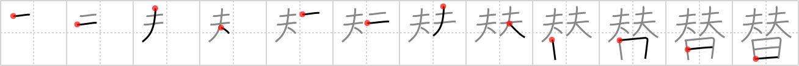

# {替}

## `exchange`

## Strokes: 12

## Reading:

### On-Yomi: タイ &mdash; Kun-Yomi: か.える、か.え-、か.わる

### Examples: 替える (か.える), 替わる (か.わる)

## Words:

替える(かえる): to exchange, to interchange, to substitute, to replace

切り替える(きりかえる): to change, to exchange, to convert, to renew, to throw a switch, to replace, to switch over

取り替え(とりかえ): swap, exchange

為替(かわせ): money order, exchange

着替え(きがえ): changing clothes, change of clothes

交替(こうたい): alternation, change, shift, relief, relay

両替(りょうがえ): change, money exchange

取り替える(とりかえる): exchange
