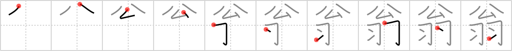

## `venerable old man`

## [10]

## Reading:

### On-Yomi: オウ &mdash; Kun-Yomi: おきな

## Heisig story:

Public . . . feathers.

## Koohii stories:

1) [<a href="http://kanji.koohii.com/profile/daredawg3583">daredawg3583</a>] 22-2-2007(327): The<strong> venerable old man</strong> is the <em>public</em> figure head of the Native American Village, answering all questions and solving all problems. The higher in rank you get in this tribe, the more <em>feathers</em> decorate you. Imagine this old man covered in beautiful feathers.

2) [<a href="http://kanji.koohii.com/profile/Shibo">Shibo</a>] 27-5-2008(96): The<strong> venerable old man</strong> is using the <em>public restroom</em> in the park where he feeds the pigeons. But, alas, there is no toilet paper! So, he&#039;s caught a pigeon and is using it to wipe his bottom. (note the feathers on the bottom of the kanji, this helps remember placement). Can you see the <em>feathers</em> flying everywhere?

3) [<a href="http://kanji.koohii.com/profile/martinnz">martinnz</a>] 5-8-2009(37): The<strong> venerable old man</strong> is in the <em>public</em> park feeding the <em>pigeons</em>.

4) [<a href="http://kanji.koohii.com/profile/sethg">sethg</a>] 25-3-2009(20): Imagine a<strong> venerable old man</strong> sitting on a <em>public</em> park bench, with hair that looks like <em>white feathers</em>.

5) [<a href="http://kanji.koohii.com/profile/rich_f">rich_f</a>] 18-7-2007(14): Whenever I see <em>feathers</em>, I think of <em>Haibane.</em> The <strong>venerable old man</strong> is the <em>public</em> communicator to the <em>Haibane</em>. (Works if you watched <em>Haibane Renmei</em>, I guess.).

6) [<a href="http://kanji.koohii.com/profile/nesert">nesert</a>] 24-6-2010(9): The<strong> venerable old man</strong> never lets the <em>public</em> ruffle his <em>feathers</em>.

7) [<a href="http://kanji.koohii.com/profile/shimouma">shimouma</a>] 7-6-2008(8): Venerable old men should definitely not appear in public in feathered boa&#039;s.

8) [<a href="http://kanji.koohii.com/profile/cingo">cingo</a>] 11-4-2012(4): This kanji was the inspiration for Garcia Marquez&#039; story &#039;A Very Old Man with Enormous Wings&#039;. The kanji tells the story of a <strong>venerable old man</strong> with enormous wings with thick <em>feathers</em> who is found in a <em>public</em> park lying in the mud one stormy afternoon.

9) [<a href="http://kanji.koohii.com/profile/Chaze">Chaze</a>] 1-6-2010(4): Remember that after you <a href="../v4/574">learn</a> (#574 習) something you put a white <em>feather</em> on you? This old man has learned so much, he&#039;s literally cladded with feathers. But he&#039;s offering his knowledge to the <em>public</em>, answering questions from all citizens. Imagine them inquiring of him &quot;Oh<strong> venerable old man</strong>, please tell me..&quot;.

10) [<a href="http://kanji.koohii.com/profile/uchifly">uchifly</a>] 11-1-2010(4): When the VENERABLE OLD (Red Indian) MAN appears in PUBLIC, he always wears his FEATHERS...
