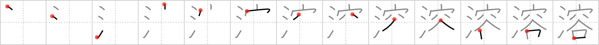

## `melt`

## [13]

## Reading:

### On-Yomi: ヨウ &mdash; Kun-Yomi: と.ける、と.かす、と.く

## Heisig story:

Water . . . contain.

## Koohii stories:

1) [<a href="http://kanji.koohii.com/profile/Matthew">Matthew</a>] 15-6-2006(183): Think of what happens when the snow on top of the mountains<strong> melt</strong>s: it turns into <em>water</em> and flows down onto the rooftops of all the <em>houses</em> in the <em>valley</em> below.

2) [<a href="http://kanji.koohii.com/profile/Ricardo">Ricardo</a>] 11-11-2006(140): [melt; dissolve; thaw] An ice cube is <strong>melt</strong>ing, loosing the <em>water</em> it <em>contained</em>.

3) [<a href="http://kanji.koohii.com/profile/AndamanIslander">AndamanIslander</a>] 15-4-2008(45): An inconvenient truth: when the polar ice caps<strong> melt</strong>, there&#039;s going to be no way to <em>contain</em> the rising <em>water</em> level...

4) [<a href="http://kanji.koohii.com/profile/Lucien">Lucien</a>] 12-9-2008(42): Imagine &quot;WARNING: MAY CONTAIN WATER. DO NOT<strong> MELT</strong>.&quot; engraved in a bunch of ice cubes you just bought.

5) [<a href="http://kanji.koohii.com/profile/crystalcastlecreature">crystalcastlecreature</a>] 6-8-2008(13): WATER CONTAINED in ice, <strong>MELTS</strong>.

6) [<a href="http://kanji.koohii.com/profile/gyouza">gyouza</a>] 2-10-2010(10): Ice <em>contains</em> <em>water</em>. That becomes apparent when it <strong>melts</strong>.

7) [<a href="http://kanji.koohii.com/profile/Hyland1">Hyland1</a>] 16-4-2013(9): If the glaciers<strong> melt</strong> all the water they contain will be released; and we will be screwed.

8) [<a href="http://kanji.koohii.com/profile/Francois">Francois</a>] 1-6-2008(9): Whatever CONTAINS WATER can<strong> melt</strong>.

9) [<a href="http://kanji.koohii.com/profile/stormwyrm">stormwyrm</a>] 19-10-2011(6): During the Fukushima nuclear disaster <em>water</em> was pumped into the <em>contain</em>ment vessel of the reactors in an attempt to avoid a full <strong>melt</strong>down.

10) [<a href="http://kanji.koohii.com/profile/yotuel">yotuel</a>] 28-9-2009(6): <strong>MELT</strong>ING = Losing the WATER you CONTAIN.

### {V4: 791, V6: 854}
