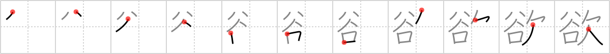

## `longing`

## [11]

## Reading:

### On-Yomi: ヨク &mdash; Kun-Yomi: ほっ.する、ほ.しい

## Heisig story:

<i>Valley</i> . . . <i>yawn</i>. Be sure to keep the key word distinct from <i>pining</i> (Frame 683).

## Koohii stories:

1) [<a href="http://kanji.koohii.com/profile/Danieru">Danieru</a>] 22-6-2008(283): Guess what? Japanese has dirty words too! (In fact, a lot of them) A sexual story is NOT inappropriate here, as this kanji is very sexual, such as in 性欲 ; lust. As for a story: the <em>lack</em> of contact with a woman&#039;s <em>valley</em> will leave a man<strong> LONGING</strong> for love.

2) [<a href="http://kanji.koohii.com/profile/mattoc_g">mattoc_g</a>] 20-7-2006(139): The valley has something my life is lacking.... something I&#039;ve been<strong> longing</strong> for.. peace and quiet.

3) [<a href="http://kanji.koohii.com/profile/konayuki">konayuki</a>] 23-9-2008(33): Imagine a young girl who has lived in this <em>valley</em> her whole life. She&#039;s looking out <em>yawning</em>. When confronted about it, she simply replies &quot;This is such a <em>valley of lack</em>! There&#039;s nothing to do here but <em>yawn</em>! I&#039;m<strong> longing</strong> to get out of here. I&#039;m<strong> longing</strong> for something more than just this <em>valley of lack</em>, this <em>valley of yawns</em>&quot;.

4) [<a href="http://kanji.koohii.com/profile/synewave">synewave</a>] 24-7-2006(14): Nausicaa is<strong> longing</strong> to get back to the <em>valley</em> because she is homesick. She <em>lacks</em> her home.

5) [<a href="http://kanji.koohii.com/profile/shimouma">shimouma</a>] 26-4-2008(13): When I lived in the valley I spent all my time yawning - now I find myself<strong> longing</strong> to return.

6) [<a href="http://kanji.koohii.com/profile/thomasritz">thomasritz</a>] 18-8-2009(7): Im <em>Tal</em> des <em>Mangels</em> <strong>begehren</strong> die Leute nach allem, denn sie haben nichts.

7) [<a href="http://kanji.koohii.com/profile/fuaburisu">fuaburisu</a>] 10-10-2005(7): This is a long yawn from someone<strong> longing</strong> for a life beyond the valley. Think of someone who always lived in that valley. The grass is always greener on the other side. Note : the distinction with FRAME 633 “pining”, is that<strong> longing</strong> is “an earnest, heartfelt desire, especially for something beyond reach”.

8) [<a href="http://kanji.koohii.com/profile/decamer0n">decamer0n</a>] 16-4-2007(6): This is used in several words meaning sexual desire. So, using the sexual connotations to be found in the left-hand primitive, and the sense of <em>lacking</em> in the right-hand primitive, it should be pretty easy to conjure up an image of<strong> longing</strong>...

9) [<a href="http://kanji.koohii.com/profile/kanjihito">kanjihito</a>] 7-10-2011(5): He had a<strong> longing</strong> for the life in a lush <em>valley</em>, where he could <em>yawn</em> the day away.

10) [<a href="http://kanji.koohii.com/profile/jonusbalonus">jonusbalonus</a>] 7-5-2013(3): I&#039;m<strong> longing</strong> for your <em>valley</em> baby, because it&#039;s your <em>valley</em> that I <em>lack</em>.
