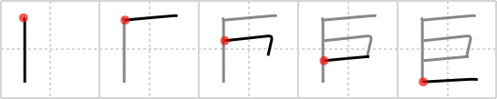

## `gigantic`

## [5]

## Reading:

### On-Yomi: キョ

## Heisig V6:

This kanji depicts a <b>gigantic</b> &quot;pop-eye,&quot; which accounts for its shape. Be sure not to confuse it with the <i>slave</i> (<i>retainer</i>) we just learned.

## Koohii stories:

1) [<a href="http://kanji.koohii.com/profile/chamcham">chamcham</a>] 1-5-2007(342): This is actually the top view of a porn star with a<strong> gigantic</strong> erect penis. The top and bottom are his arms and the middle is his penis. Imagine him making the pumping motion while he&#039;s banging some chick. The arms move in, the penis moves out and vice versa.

2) [<a href="http://kanji.koohii.com/profile/thegeelonghellswan">thegeelonghellswan</a>] 4-10-2008(130): The letter E, with a<strong> GIGANTIC</strong> middle stroke.

3) [<a href="http://kanji.koohii.com/profile/Peppi">Peppi</a>] 12-5-2009(25): The <em>slave</em> without his bonds (the missing two strokes) feels<strong> gigantic</strong>.

4) [<a href="http://kanji.koohii.com/profile/lugelen">lugelen</a>] 9-1-2012(23): <strong>Gigantic</strong>... nay, 巨 normous!

5) [<a href="http://kanji.koohii.com/profile/Shizuru">Shizuru</a>] 1-6-2008(17): You know if this 漢字 was just rotated 90 degrees to left/right, there wouldn&#039;t be any stories on this page...

6) [<a href="http://kanji.koohii.com/profile/unicornpuddlefoot">unicornpuddlefoot</a>] 30-11-2008(5): An enormous E for elephant.

7) [<a href="http://kanji.koohii.com/profile/raseru">raseru</a>] 27-3-2008(5): A<strong> gigantic</strong> man, 口 is his head, and the backwards コ is his arms above his head. He&#039;s too<strong> gigantic</strong> to fit in the kanji!

8) [<a href="http://kanji.koohii.com/profile/tenricefieldsglue">tenricefieldsglue</a>] 19-5-2009(3): The slave did something<strong> gigantic</strong>. He ate some spinach and break his chains to become a free man.

9) [<a href="http://kanji.koohii.com/profile/TokyoXtreme">TokyoXtreme</a>] 1-8-2010(2): <strong>Gigantic</strong> is a bit abstract, but this image resembles an X-Wing fighter. A squadron of them flew towards the Death Star, which was truly<strong> gigantic</strong>.

10) [<a href="http://kanji.koohii.com/profile/meredithcat">meredithcat</a>] 27-3-2010(2): Primitive meaning:<strong> gigantic</strong> cyclops (you can even see its one <em>eye</em>).
