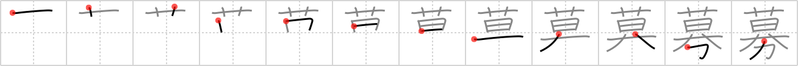

# {861}

## `recruit`

## [12]

## Reading:

### On-Yomi: ボ &mdash; Kun-Yomi: つの.る

### Examples: 募る (つの.る)

## Words:

応募(おうぼ): subscription, application

公募(こうぼ): public appeal, public contribution

募る(つのる): to invite, to solicit help participation etc

募金(ぼきん): fund-raising, collection of funds

募集(ぼしゅう): recruiting, taking applications
