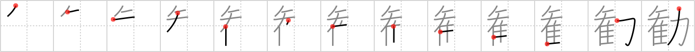

## `persuade`

## [13]

## Reading:

### On-Yomi: カン、ケン &mdash; Kun-Yomi: すす.める

## Heisig V6:

Pegasus . . . power.

## Koohii stories:

1) [<a href="http://kanji.koohii.com/profile/synewave">synewave</a>] 11-9-2006(183): Mnemonic &quot;<em>pegasus</em> <strong>persuasion</strong> <em>power</em>&quot;. I think of the hippogriff from Harry Potter as being like a <em>pegasus</em>. To befriend a hippogriff, you have to<strong> persuade</strong> it you mean no harm, you can do this if you have &quot;<em>pegasus</em> <strong>persuasion</strong> <em>power</em>&quot;.

2) [<a href="http://kanji.koohii.com/profile/tcjeff">tcjeff</a>] 13-6-2008(76): A little girl is trying to<strong> persuade</strong> a little boy to play dolls with her. She offers him her plastic <em>pegasus</em> figure and says, &quot;See? <em>Pegasus</em> has <em>muscles</em>. He&#039;s got <em>Pegasus</em> <em>power</em>.&quot; And the little boy says &quot;You cannot<strong> persuade</strong> me to play with your flying unicorn. I&#039;m not of that persuasion.&quot;.

3) [<a href="http://kanji.koohii.com/profile/Wosret">Wosret</a>] 26-8-2008(53): Only the <strong>power</strong>ful can<strong> persuade</strong> <strong>Pegasus</strong> to let them ride her.

4) [<a href="http://kanji.koohii.com/profile/AndamanIslander">AndamanIslander</a>] 18-4-2008(31): <em>Pegasus Power?</em> What kind of dorky name for an electric company is that? You&#039;ll never ever<strong> persuade</strong> me to invest my money in a company called <em>Pegasus Power</em>.

5) [<a href="http://kanji.koohii.com/profile/astgtciv">astgtciv</a>] 15-4-2007(16): The crafty <em>Pegasus</em> <strong>persuades</strong> stupid <em>Conan</em> that he, <em>Pegasus</em>, should ride on <em>Conan&#039;s</em> back, and not the other way around. Picture it! The power of persuasion...

6) [<a href="http://kanji.koohii.com/profile/Kambei">Kambei</a>] 18-5-2009(11): <em>Pegasus</em> was<strong> persuade</strong>d by <em>Hercules</em> to let ride him.

7) [<a href="http://kanji.koohii.com/profile/tharvey">tharvey</a>] 18-7-2009(9): I picture a cutesy anime character yelling &quot;Persuasive <em>Pegasus Power</em>!&quot; (the name of the attack).

8) [<a href="http://kanji.koohii.com/profile/ruisu">ruisu</a>] 14-11-2007(8): <em>Pegasus</em> was <strong>persuaded</strong> to land by more <em>powerful</em> F-22 Raptors.

9) [<a href="http://kanji.koohii.com/profile/dingomick">dingomick</a>] 17-4-2007(7): &quot;Oh yeah? Maybe THIS will <strong>persuade</strong> you!&quot; Bust out a <em>pegasus</em> all flexin&#039; his <em>muscles</em> and snorting.

10) [<a href="http://kanji.koohii.com/profile/shuusaku">shuusaku</a>] 25-2-2010(6): The <em>PEGASUS</em> has the <em>POWER</em> to<strong> PERSUADE</strong> all the other living creatures. That&#039;s why he has the <a href="../571">authority</a> (#571 権).
