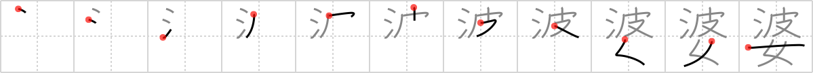

## `old woman`

## [11]

## Reading:

### On-Yomi: バ &mdash; Kun-Yomi: ばば、ばあ

## Heisig story:

Waves . . . woman.

## Koohii stories:

1) [<a href="http://kanji.koohii.com/profile/fuaburisu">fuaburisu</a>] 10-10-2005(325): An<strong> old woman</strong> is seen here as a woman with waves (i.e. wrinkles, creases).

2) [<a href="http://kanji.koohii.com/profile/walexander5">walexander5</a>] 20-7-2008(58): Picture an<strong> old woman</strong> on her balcony, watching the <em>waves</em>, wondering if her husband will ever return from the sea.

3) [<a href="http://kanji.koohii.com/profile/bihzad">bihzad</a>] 20-2-2008(36): You know &quot;The Old Man and the Sea.&quot; Well, this is the sequel, &quot;The<strong> Old Woman</strong> and the Sea Waves.&quot;.

4) [<a href="http://kanji.koohii.com/profile/jotun">jotun</a>] 21-4-2008(28): The Queen. She&#039;s an<strong> old woman</strong> who <em>waves</em>.

5) [<a href="http://kanji.koohii.com/profile/liosama">liosama</a>] 6-12-2008(13): Come one guys.. this one is staring at you right in the face... water + skin + woman. Ok, no matter what you used int he previous frame thsi will help anyway. When your skin is in water for a long time it turns all wavey and old looking. Woman are always sensitive about looking old. wala.

6) [<a href="http://kanji.koohii.com/profile/jonny_wonny">jonny_wonny</a>] 11-3-2009(11): (Adapted from fuaburisu&#039;s) An<strong> old woman</strong> is seen here as a woman with waves (i.e. wrinkles, creases). To create a stronger visual, one which also depicts the primitive ordering, I imagine seeing an<strong> old woman</strong>&#039;s face floating a few feet beneath the <em>waves</em>, kind of like the faces in the Dead Marsh from the Two Towers. The image gives me an eerie feeling, making the story more memorable.

7) [<a href="http://kanji.koohii.com/profile/Sebastian">Sebastian</a>] 28-7-2010(7): [ENGLISH] Your GRANDMA ( お婆さん ) is trying to learn surf (ride the <strong>waves</strong>). Unfortunately, the<strong> OLD WOMAN</strong> always ends up under the waves, rather than over them. Stop laughing and go help her now! = = = [ESPAÑOL] Imagina a tu ABUELITA ( お婆さん ) (o a la de alguien más, si así lo prefieres) tratando de surfear. Por más que trata de dominar las <strong>olas</strong>, al final son las <strong>olas</strong> las que terminan siempre sobre la pobre <strong>mujer</strong>. ¡Deja de reirte y anda a ayudarla ahora!

8) [<a href="http://kanji.koohii.com/profile/kanjihito">kanjihito</a>] 20-12-2009(5): The<strong> old woman</strong> has <em>waves</em> of skin forming the wrinkles of age, which brings this <em>woman</em> down.

9) [<a href="http://kanji.koohii.com/profile/narazumono">narazumono</a>] 20-11-2008(3): <em>Waves</em> crashed over the nude <em>woman</em> on the beach, I ran to her but when I got close I realized she was an<strong> old woman</strong>! Ahh my eyes!!

10) [<a href="http://kanji.koohii.com/profile/Flipper">Flipper</a>] 2-9-2011(2): Durch die nukleare Schock-<em>Welle</em> wird aus der jungen <em>Frau</em> eine <strong>Greisin</strong>.
