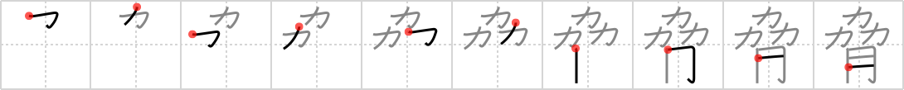

# {脅}

## `threaten`

## Strokes: 10

## Reading:

### On-Yomi: キョウ &mdash; Kun-Yomi: おびや.かす、おど.す、おど.かす

### Examples: 脅かす (おど.かす), 脅す (おど.す), 脅かす (おびや.かす)

## Words:

脅かす(おどかす): to threaten, to coerce

脅す(おどす): to threaten, to menace

脅迫(きょうはく): threat, menace, coercion, terrorism
