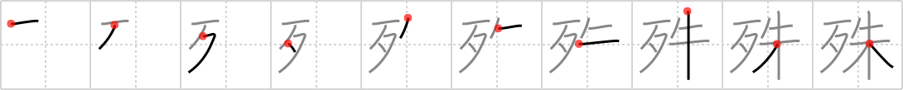

## `particularly`

## [10]

## Reading:

### On-Yomi: シュ &mdash; Kun-Yomi: こと

## Heisig story:

Bones . . . vermilion.

## Koohii stories:

1) [<a href="http://kanji.koohii.com/profile/saranich">saranich</a>] 14-3-2006(177): A t-bone steak is vermilion -<strong> particularly</strong> if served rare.

2) [<a href="http://kanji.koohii.com/profile/matticus">matticus</a>] 23-10-2006(146): Castlevania -- The <em>vermillion</em> skeletons (<em>bones</em>) are<strong> particularly</strong> hard because they just keep regenerating.

3) [<a href="http://kanji.koohii.com/profile/Thora">Thora</a>] 29-7-2008(143): [Too abstract, so:<strong> particularly</strong> -&gt; particles as recall hint. ] The <em>bones</em> had enough <em>vermillion</em> particles on them to identify the victim. DNA is<strong> particularly</strong> accurate.

4) [<a href="http://kanji.koohii.com/profile/fuaburisu">fuaburisu</a>] 10-10-2005(33): The vermilion bone is<strong> particularly</strong> (especially) different from the others (it&#039;s a dog toy made of rubber).

5) [<a href="http://kanji.koohii.com/profile/howdycowdy">howdycowdy</a>] 18-4-2008(31): &quot;Not<strong> PARTICULARLY</strong>,&quot; I said when asked if I was interested in buying a <em>vermillion</em> <em>bone</em>.

6) [<a href="http://kanji.koohii.com/profile/Axlen">Axlen</a>] 12-5-2010(21): &#039;<em>Bones</em>&#039; coated with &#039;<em>vermilion</em>&#039; are<strong> Particularly</strong> well preserved. <em>(The first known use of vermilion - <a href="http://www.springerlink.com/content/jxu43806302r72l2/">http://www.springerlink.com/content/jxu43806302r72l2/</a>)</em>.

7) [<a href="http://kanji.koohii.com/profile/dihutenosa">dihutenosa</a>] 4-9-2007(15): This might be over a few heads. A &quot;<em>vermillion</em> <em>bone</em>&quot; is a<strong> particularly</strong> light-skinned Black person (in my experience, used mainly towards women). Some people find them<strong> particularly</strong> attractive. (okay actually &quot;redbone&quot;, but still).

8) [<a href="http://kanji.koohii.com/profile/Harrow">Harrow</a>] 6-3-2009(8): Ancient <strong>bones</strong> stained <strong>vermilion</strong> are<strong> particularly</strong> interesting because they give insight into burial practices . [BTW vermilion has been isolated on the Shroud of Turin-- this helps me remember the association of old bones and vermilion]. 殊勝 （しゅしょう） (な adjective) laudable.

9) [<a href="http://kanji.koohii.com/profile/lernsky">lernsky</a>] 16-12-2012(6): <em>Bone</em> itself is usually white. But the <em>bone</em> marrow inside it is <strong>particularly</strong> <em>vermillion</em>. A baby has blood creating red marrow in all of its bones which mainly turns later into white marrow. So: on the inside of a <em>bone</em> there may be a <em>drop</em> of marrow that has <em>not yet</em> turned white, which is <strong>particularly</strong> <em>vermillion</em>.

10) [<a href="http://kanji.koohii.com/profile/fvenegas">fvenegas</a>] 15-4-2012(6): [Excuse the vulgar story] Most <em>boners</em> tend to be <em>vermilion</em> in color —<strong> particularly</strong> because of the blood that rushes to it. (think: especially, exceptionally).
