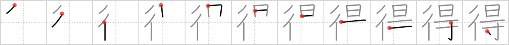

# {得}

## `gain`

## Strokes: 11

## Reading:

### On-Yomi: トク &mdash; Kun-Yomi: え.る、う.る

### Examples: 得る (う.る), 得る (え.る)

## Words:

獲得(かくとく): acquisition, possession

心得(こころえ): knowledge, information

所得(しょとく): income, earnings

説得(せっとく): persuasion

得点(とくてん): score, points made, marks obtained, runs

止むを得ない(やむをえない): cannot be helped, unavoidable

得る(うる): obtain, acquire

得る(える): get, gain, win

心得る(こころえる): be informed, have thorough knowledge

損得(そんとく): loss and gain, advantage and disadvantage

得意(とくい): pride, triumph, prosperity, one´s strong point, one´s forte, one´s specialty, customer, client

納得(なっとく): consent, assent, understanding, agreement, comprehension, grasp
