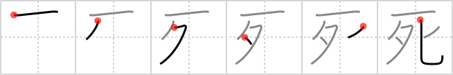

## `death`

## [6]

## Reading:

### On-Yomi: シ &mdash; Kun-Yomi: し.ぬ、し.に-

## Heisig story:

<i>Bones</i> . . . <i>spoon</i>. Note how the first stroke is extended to the right, forming a sort of &quot;roof&quot; overhead.

## Koohii stories:

1) [<a href="http://kanji.koohii.com/profile/darg_sama">darg_sama</a>] 3-11-2005(252): Ok, this is where knowing some Eastern culture comes in handy! In Japanese society, when someone dies they creamate the body and pick out the remaining bones with special chopsticks. In this case, they&#039;re out of chopsticks so they decide to use (gasp!) a spoon instead.

2) [<a href="http://kanji.koohii.com/profile/pacersfan218">pacersfan218</a>] 1-9-2007(108): Imagine the grim reaper (the bringer of<strong> death</strong>), carrying a <em>spoon</em> made of human <em>bones</em> instead of a scythe.

3) [<a href="http://kanji.koohii.com/profile/blackstockc">blackstockc</a>] 3-2-2008(68): The Grim Reaper eats bones for breakfast (with a spoon).

4) [<a href="http://kanji.koohii.com/profile/Biene">Biene</a>] 28-4-2008(25): Remeber <strong>DEATH</strong> from Terry Pratchett&#039;s Discworld books? Now picture <em>bony</em> <strong>DEATH</strong> as he sits down (in the book &quot;Mort&quot;) in the restaurant together with his new apprentice to eat a bowl of hot curry with a <em>spoon</em>.

5) [<a href="http://kanji.koohii.com/profile/peepiceek">peepiceek</a>] 20-7-2008(17): <em>One evening</em> I choked to<strong> death</strong> on a <em>spoon</em>. (Don&#039;t ask how I wrote this...).

6) [<a href="http://kanji.koohii.com/profile/TunS77">TunS77</a>] 23-10-2008(14): He <em>boned</em> and <em>spooned</em> her to<strong> DEATH</strong>! It&#039;s all about sex nowadays...

7) [<a href="http://kanji.koohii.com/profile/tcjeff">tcjeff</a>] 11-6-2008(12): When a Japanese person dies in Japan, they cremate the person and pick out the <em>bones</em> with chopsticks. If a foreigner dies in Japan, they cremate the person and pick out the <em>bones</em> with a <em>spoon</em>. Not really, of course, but it&#039;s funny to imagine yourself as that dead foreigner....in a morbid way.

8) [<a href="http://kanji.koohii.com/profile/ziggr">ziggr</a>] 24-10-2006(11): I confuse <a href="../v4/485">deceased</a> (#485 亡), <a href="../v4/815">death</a> (#815 死), and <a href="../v4/1132">departed</a> (#1132 逝). Let <a href="../v4/485">deceased</a> (#485 亡) be the adjective deceased/dead, let <a href="../v4/815">death</a> (#815 死) be the personified<strong> Death</strong>, the robed <em>skeleton</em> of the Grim Reaper, perhaps with a big long <em>spoon</em> instead of a scythe. —— I also use darg_sama&#039;s description of picking out the <em>bones</em> with a <em>spoon</em>.

9) [<a href="http://kanji.koohii.com/profile/Ouzop1994">Ouzop1994</a>] 29-8-2012(7): Just watch this:<a href="http://www.youtube.com/watch?v=9VDvgL58h_Y">http://www.youtube.com/watch?v=9VDvgL58h_Y</a> Now there is NO way you&#039;ll forget this kanji.

10) [<a href="http://kanji.koohii.com/profile/stupiddog">stupiddog</a>] 23-7-2009(5): Because the first stroke is full width here, I decided against using the bones primitive and rebuild this kanji. Story: <em>One</em> <em>evening</em>, grandpa was <em>sitting</em> in his rocking chair when <strong>death</strong> struck.
