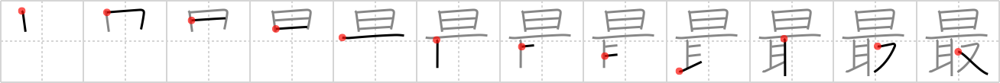

## `utmost`

## [12]

## Reading:

### On-Yomi: サイ、シュ &mdash; Kun-Yomi: もっと.も、つま

## Heisig story:

Sun . . . take.

## Koohii stories:

1) [<a href="http://kanji.koohii.com/profile/Nukemarine">Nukemarine</a>] 28-8-2007(274): TAKE the<strong> UTMOST</strong> care when you SUN bath all DAY, or you&#039;ll get burned from your EARS to your CROTCH.

2) [<a href="http://kanji.koohii.com/profile/khooks">khooks</a>] 30-9-2006(148): Do your<strong> utmost</strong> - seize(take) the day.

3) [<a href="http://kanji.koohii.com/profile/mikedough2">mikedough2</a>] 14-11-2007(60): The renewable energy that man can <em>take</em> from the <em>sun</em> is of<strong> utmost</strong> importance to the world&#039;s future.

4) [<a href="http://kanji.koohii.com/profile/theBryan">theBryan</a>] 24-7-2008(33): To take the<strong> utmost</strong> out of life, you must live fully each day. You must Carpe Diem, Seize or Take the day.

5) [<a href="http://kanji.koohii.com/profile/Perry">Perry</a>] 11-4-2010(28): Its of the<strong> UTMOST</strong> importance this doesn&#039;t TAKE all DAY.

6) [<a href="http://kanji.koohii.com/profile/johngwk">johngwk</a>] 4-9-2010(11): Do your<strong> utmost</strong>! The day is yours for the taking!

7) [<a href="http://kanji.koohii.com/profile/xxinde">xxinde</a>] 30-3-2010(9): <em>Carpe diem</em> (theBryan et al.) serves well enough as a mnemonic. The one thing to remember is that the primitive order follows the Japanese sentence structure of object-を-verb ( 日を取る ).

8) [<a href="http://kanji.koohii.com/profile/fuaburisu">fuaburisu</a>] 10-10-2005(9): “Take in the sun” with<strong> utmost</strong> care for your skin.

9) [<a href="http://kanji.koohii.com/profile/coinbaahd">coinbaahd</a>] 22-12-2011(7): The<strong> utmost</strong> worst person 最悪 （さいあく） is someone who <em>takes</em> the <em>sun</em>. Now everybody will die soon. What a dick.

10) [<a href="http://kanji.koohii.com/profile/raseru">raseru</a>] 26-3-2008(7): The SUN is of the<strong> utmost</strong> importance. We TAKE this for granted.

### {V4: 821, V6: 884}
