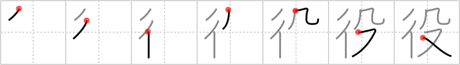

# {役}

## `duty`

## Strokes: 7

## Reading:

### On-Yomi: ヤク、エキ

### Examples: 役所 (やくしょ), 役目 (やくめ), 荷役 (かやく)

## Words:

役(えき): war, campaign, battle

重役(おもやく): heavy responsibilities, director

役職(やくしょく): post, managerial position, official position

役立つ(やくだつ): to be useful, to be helpful, to serve the purpose

役場(やくば): town hall

重役(じゅうやく): heavy responsibilities, director

主役(しゅやく): leading part, leading actor or actress

役(やく): use, service, role, position

役者(やくしゃ): actor, actress

役所(やくしょ): government office, public office

役人(やくにん): government official

役目(やくめ): duty, business

役割(やくわり): part, assigning (allotment of) parts, role, duties

役に立つ(やくにたつ): useful
