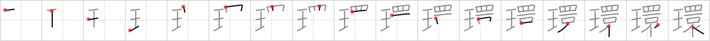

## `ring`

## [17]

## Reading:

### On-Yomi: カン &mdash; Kun-Yomi: わ

## Heisig story:

<i>Jewel</i> . . . <i>eye</i> . . . <i>ceiling</i> . . . <i>mouth</i> . . . <i>scarf</i>. The number of elements is large here, so take extra care. Learn it in conjunction with the next frame, since these are the only two cases in this book where the combination of elements to the right appears.

## Koohii stories:

1) [<a href="http://kanji.koohii.com/profile/fuaburisu">fuaburisu</a>] 27-11-2008(253): Together with the next kanji, the keywords spell “send back the<strong> ring</strong>”. First we have a <em>jewel</em>. Next we have the <em>great eye</em> of Sauron searching for the fellowship hiding under the many <em>ceilings</em> during their journey. The fourth and fifth primitives are the <em>mouth</em> of Gollum always mumbling “My preciousss”; and Pippin&#039;s <em>scarf</em>! Placement: the eye appears at the top similarly to how the Great Eye of Sauron is perched atop the Dark Tower.

2) [<a href="http://kanji.koohii.com/profile/meolox">meolox</a>] 15-12-2007(137): In conjunction with <a href="../v4/837">send back</a> (#837 還)....... When I tried to give her the <em>jewel</em><strong> ring</strong>, she <em>eyed</em> me, threw it to the <em>floor</em>, opened her <em>mouth </em>and tried to speak, she said nothing. She grabbed her <em>scarf</em> and left.

3) [<a href="http://kanji.koohii.com/profile/saranich">saranich</a>] 19-11-2006(83): The Saudi woman accepted the marriage<strong> ring</strong>, though it meant lowering her eyes to the floor and covering her mouth with a scarf.

4) [<a href="http://kanji.koohii.com/profile/Es2Kay">Es2Kay</a>] 20-2-2011(38): There&#039;s no &quot;jewel&quot; in this kanji!! It&#039;s a &quot;king&quot; you idiots!

5) [<a href="http://kanji.koohii.com/profile/Spidercat">Spidercat</a>] 15-1-2008(26): The one<strong> ring</strong> is the <em>jewel</em> that the <em>eye</em> of Sauron, above the <em>ceiling</em> of his tower, is searching for. To get it back, Sauron sends his nazguls, whose insubstantial <em>mouths</em> are hidden behind a <em>scarf</em>.

6) [<a href="http://kanji.koohii.com/profile/robertmyers">robertmyers</a>] 13-5-2009(18): Here we see a<strong> ring</strong> heist. Stolen is a<strong> ring</strong> with a large <em>jewel</em>. The eye on the ceiling? Well, of course that is the security camera and below with see the shop owner with tied up with a scarf stuffed in her mouth.

7) [<a href="http://kanji.koohii.com/profile/ashman63">ashman63</a>] 3-5-2008(16): In the Lord of the <strong>Ring</strong>s: Return of the <em>King</em>, the <em>king,</em> Aragorn, finally claims the throne of Gondor and attempts to defeat the <em>Eye</em> of Sauron. But the only way the <em>king</em> can beat the <em>Eye</em> of Sauron is by having the <em>One</em> <strong>Ring</strong> thrown into the <em>mouth</em> of Mordor...wrapped delicately in a <em>silk scarf</em>, of course.

8) [<a href="http://kanji.koohii.com/profile/crystalcastlecreature">crystalcastlecreature</a>] 17-1-2009(9): An annoying little girl, &quot; JEWELS!! EYE ONEt (want) a<strong> ring</strong>!&quot; her big MOUTH says as she wears an expensive SCARF.

9) [<a href="http://kanji.koohii.com/profile/Clint">Clint</a>] 22-10-2008(9): [+fuaburisu] The<strong> ring</strong> of power is the <em>jewel</em> of Sauron&#039;s <em>eye</em>, and his <em>eye</em> scans ceaselessly for it. The fellowship hides from the <em>eye</em> under a <em>ceiling</em>, but even so, the <em>mouth</em> of Sauron proclaims to Frodo &quot;I see you...&quot; Frodo shivers upon hearing this and, wrapping a <em>scarf</em> about his neck to try and keep warm, presses on towards Mordor.

10) [<a href="http://kanji.koohii.com/profile/shinyclef">shinyclef</a>] 28-4-2009(8): (Just some trivia for those interested. 睘 is a Chinese character that means &#039;round&#039; or &#039;stare&#039;. I think it&#039;s a rare character on its own though and I don&#039;t think you&#039;ll ever see it in Japanese, but thought it might be interesting to know ^^.).

### {V4: 836, V6: 899}
