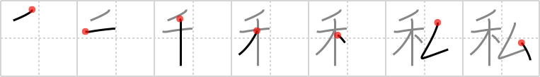

## `private`

## [7]

## Reading:

### On-Yomi: シ &mdash; Kun-Yomi: わたくし、わたし

## Heisig V6:

<i>Wheat</i> . . . <i>elbow</i>. Like the characters for I (Frame 17) and <i>ego</i> (Frame 690), this kanji is also representative of the subject, with the special connotation of <b>privacy</b>.

## Koohii stories:

1) [<a href="http://kanji.koohii.com/profile/raulir">raulir</a>] 1-5-2006(294): Warning sign: &quot;Private wheat, trespassers will be elbowed&quot;.

2) [<a href="http://kanji.koohii.com/profile/hilber">hilber</a>] 12-12-2009(114): A joke so bad as &quot;wheatashi wa&quot; deserves an elbow in the<strong> private</strong> parts.

3) [<a href="http://kanji.koohii.com/profile/Zarxrax">Zarxrax</a>] 7-5-2008(82): I already know this as watashi, or &quot;I&quot;. In order to associate the keyword of<strong> private</strong>, I&#039;ll think of this one as &quot;Private I&quot;, like a detective.

4) [<a href="http://kanji.koohii.com/profile/baldy514">baldy514</a>] 2-2-2009(48): Wheatashi wa.

5) [<a href="http://kanji.koohii.com/profile/matticus">matticus</a>] 1-12-2005(43): I was glad that nobody was around when I stuck my <em>elbow</em> in my <em>cereal</em> bowl and spilled the whole damned mess all over myself. Something that stupid should remain<strong> private</strong> -- between &quot;me, myself, and I&quot;.

6) [<a href="http://kanji.koohii.com/profile/krungthep">krungthep</a>] 26-5-2009(16): This is a<strong> private</strong> joke between my girlfriend and I; I always pronounce this kanji as &quot;<em>wheat</em>ashi&quot;. When there are people around, she <em>elbows</em> my ribs because she thinks it is a bad joke.

7) [<a href="http://kanji.koohii.com/profile/AndamanIslander">AndamanIslander</a>] 20-4-2008(11): This keyword is ludicrous. Watashi is watashi.

8) [<a href="http://kanji.koohii.com/profile/Earthlark">Earthlark</a>] 16-8-2010(10): Just imagine a couple, linked at the <em>elbows</em>, walking through the <em>wheat</em>, where they can find <strong>privacy</strong>.

9) [<a href="http://kanji.koohii.com/profile/eggmaster">eggmaster</a>] 31-7-2008(10): Hide your &quot;wheat&quot; under your &quot;elbow&quot; so that you keep it &quot;private&quot; from everybody else.

10) [<a href="http://kanji.koohii.com/profile/tritonxg">tritonxg</a>] 23-3-2010(6): [FR]<strong>privé</strong> japlt:N3 <strong>SHI wata(shi/kushi) </strong> kanji&amp;kana: 125<em> blé+coude</em> <strong>propriété privée : </strong>droit réclamé par ceux qui ont du BLE qu&#039;ils veulent se garder sous le COUDE pour leur usage PERSONNEL 私印 【しいん】personal seal 私意 【しい】personal opinion;selfishness 私語 【しご】whispering; secret talk 私物 【しぶつ】private property; personal effects 私用 【しよう】personal use;private business 公私 【こし】public and<strong> private</strong>.
