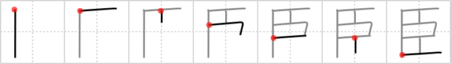

## `retainer`

## [7]

## Reading:

### On-Yomi: シン、ジン

## Heisig story:

This kanji is actually a pictograph for an eye, distorted to make it appear that the pupil is protruding towards the right. This may not be an easy form to remember, but try this: Draw it once rather large, and notice how moving the two vertical lines on the right as far right as possible gives you the pictograph of the eye in its natural form. The &quot;pop-eye&quot; image belongs to an Emperor's <b>retainer</b> standing in awe before his ruler.

## Premitive:

As a primitive, the meaning of the key word becomes slave.

## Koohii stories:

1) [<a href="http://kanji.koohii.com/profile/lifeflaw">lifeflaw</a>] 17-12-2008(112): <strong>Retainer</strong>: <em>a servant, especially one who has worked for a person or familly for a long time.</em> Now, if you imagine looking at a<strong> retainer</strong> (e.g. Igor) from top, you see how he is bending his head (middle rectange) between his two shoulders as he offers something with his two hands (upper and lower lines) to his master.

2) [<a href="http://kanji.koohii.com/profile/yvanc">yvanc</a>] 12-6-2007(71): Its a pictograph of a teeth with a<strong> retainer</strong> in the middle.

3) [<a href="http://kanji.koohii.com/profile/dwhitman">dwhitman</a>] 14-11-2007(68): <strong>Retainer</strong> = A slave (for the purposes of this kanji.) This is a pictograph of a slave collar with two handcuffs dangling from it.

4) [<a href="http://kanji.koohii.com/profile/esaulgd">esaulgd</a>] 16-4-2007(23): It may be useful to know that 大臣 （だいじん） means Minister.

5) [<a href="http://kanji.koohii.com/profile/gavin.schultz-ohkubo">gavin.schultz-ohkubo</a>] 17-5-2010(13): It&#039;s clearly an X-Wing. Piloted as usual by everyone&#039;s favourite slave /<strong> retainer</strong>, R2-D2. I&#039;ll attempt to use him as a primitive in the following kanji. (He&#039;s much easier to use as a primitive because a) he&#039;s more loveable than an X-Wing and b) he&#039;s always where the action is).

6) [<a href="http://kanji.koohii.com/profile/Filip">Filip</a>] 19-1-2008(13): (from dwhitman) look sideways ( your chin to the left) Indeed a slave collar. Middle opening for the neck, two small ones for the hands. And then two ropes attaching it to the sealing. this slave is going nowhere. (only Popeye can get out of it).

7) [<a href="http://kanji.koohii.com/profile/Axlen">Axlen</a>] 23-5-2010(7): A<strong> Retainer</strong> serves his master day and night. See how he keeps his eyes propped open with toothpicks.

8) [<a href="http://kanji.koohii.com/profile/uberclimber">uberclimber</a>] 19-11-2010(4): The<strong> retainer</strong>&#039;s eyes were bugging out, in awe of his ruler. Also a pictograph of a mouth, in profile, with the teeth clamped by a<strong> retainer</strong>. (Note: be cautious of changing this to <a href="../v4/2036">slave</a> (#2036 隷). 大臣 (だいじん) : cabinet minister.

9) [<a href="http://kanji.koohii.com/profile/decals">decals</a>] 12-3-2010(4): I change this to mean Golem. It looks kind of like a brick-wall to me, so it&#039;s a golem made of bricks(that does the princess&#039;s bidding, see next frame).

10) [<a href="http://kanji.koohii.com/profile/digicult">digicult</a>] 3-5-2009(4): As a primitive for this I use <em>eyes popping out</em>. It makes for better stories than a slave, which I find is easily confused with the violent and submissive themes in other stories.
