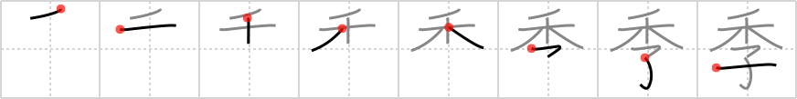

## `seasons`

## [8]

## Reading:

### On-Yomi: キ

## Words:

季刊(きかん): quarterly (e.g. magazine)

四季(しき): four seasons

季節(きせつ): season

## Koohii stories:

1) [<a href="http://kanji.koohii.com/profile/Raichu">Raichu</a>] 28-11-2006(287): There&#039;s a season for planting wheat and there&#039;s mating season for having children. 

2) [<a href="http://kanji.koohii.com/profile/kanjihito">kanjihito</a>] 11-12-2011(102): As the<strong> seasons</strong> pass, the <em>wheat</em> and the <em>children</em> grow, but the wheat grows faster, right over the children. 

3) [<a href="http://kanji.koohii.com/profile/Thora">Thora</a>] 14-3-2008(60): Look at this adorable <em>child</em> with a bale of <em>wheat</em> on his head! He&#039;s playing Autumn in his school play the &quot;Four<strong> Seasons</strong>&quot;. Aww...too cute! Perhaps we should light the wheat on fire to complete his Autumn costume. (I know, twisted...but I kept forgetting what was on his head). 

4) [<a href="http://kanji.koohii.com/profile/Peppi">Peppi</a>] 27-7-2009(36): When the <em>wheat</em> has grown so high that the farmer can&#039;t see his <em>child</em> playing in the field anymore (child under wheat) he knows that the <strong>season</strong> has come to harvest his crops. 

5) [<a href="http://kanji.koohii.com/profile/ellasevia">ellasevia</a>] 3-3-2010(21): According to Greek mythology, the <strong>seasons</strong> are a result of the <em>wheat</em> goddess&#039;s (Demeter) <em>child</em> (Persephone) having been kidnapped by Hades. 

6) [<a href="http://kanji.koohii.com/profile/astridtops">astridtops</a>] 21-6-2006(19): <em>Children</em> can tell the difference between the<strong> seasons</strong> by looking up at <em>wheat</em> plants. 

7) [<a href="http://kanji.koohii.com/profile/Codexus">Codexus</a>] 23-12-2007(8): The <em>child</em> that mysteriously disappeared last winter was found again a few<strong> seasons</strong> later when they did the harvest. He was so small he got lost under the <em>wheat</em> field. 

8) [<a href="http://kanji.koohii.com/profile/Katsuo">Katsuo</a>] 28-10-2009(6): Vivaldi&#039;s &quot;Four<strong> Seasons</strong>&quot; is being conducted by a small <em>child</em> holding aloft a piece of <em>wheat</em> instead of a baton (it&#039;s more seasonal). 

9) [<a href="http://kanji.koohii.com/profile/smithsonian">smithsonian</a>] 1-2-2007(6): If <em>Wheaties</em> are the top priority in a <em>child&#039;s</em> diet, the kid will visibly grow with the<strong> seasons</strong>. 

10) [<a href="http://kanji.koohii.com/profile/Viking101">Viking101</a>] 3-1-2010(5): Japanese people always ask if my country has four<strong> seasons</strong> like Japan. I guess they are taught from childhood that Japan&#039;s<strong> seasons</strong> are unique. Picture a <em>child</em> looking up at <em>Cap&#039;n Crunch</em> and asking him if his country has four<strong> seasons</strong>. 
