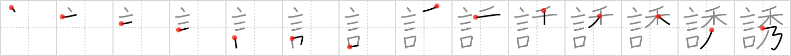

# {誘}

## `entice`

## Strokes: 14

## Reading:

### On-Yomi: ユウ、イウ &mdash; Kun-Yomi: さそ.う、いざな.う

### Examples: 誘う (さそ.う)

## Words:

勧誘(かんゆう): invitation, solicitation, canvassing, inducement, persuasion, encouragement

誘導(ゆうどう): guidance, leading, induction, introduction, incitement, inducement

誘惑(ゆうわく): temptation, allurement, lure

誘う(さそう): invite, call out
