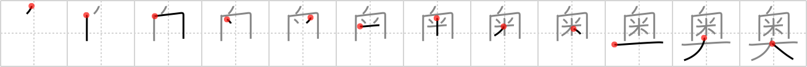

# {奥}

## `core`

## Strokes: 12

## Reading:

### On-Yomi: オウ、オク &mdash; Kun-Yomi: おく.まる、くま

### Examples: 奥 (おく)

## Words:

奥(おく): interior

奥さん(おくさん): (polite) wife, your wife, his wife, married lady, madam
