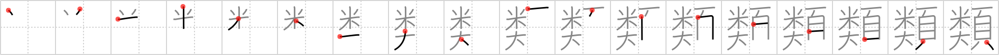

## `sort`

## [18]

## Reading:

### On-Yomi: ルイ &mdash; Kun-Yomi: たぐ.い

## Heisig story:

Rice . . . St. Bernard dog . . . head.

## Koohii stories:

1) [<a href="http://kanji.koohii.com/profile/meolox">meolox</a>] 5-1-2008(277): Note this character means<strong> sort</strong> in the sense of what kind, I believe a better keyword would be &quot;variety&quot; and this character does appear in some dictionaries with the primary meaning as variety, my story: I&#039;m in a Chinese restaurant and the waiter says &quot;What<strong> sort</strong> of <em>rice</em> would you like with your <em>dog head</em>?&quot;.

2) [<a href="http://kanji.koohii.com/profile/Nukemarine">Nukemarine</a>] 28-8-2007(118): What<strong> SORT</strong> of person comes from the U.S.? Well, some would say a person with a BIG HEAD.

3) [<a href="http://kanji.koohii.com/profile/johnzep">johnzep</a>] 29-6-2008(102): <em>Condi Rice</em> is the<strong> SORT</strong> of person that would give HEADaches to a BIG DOG.....This story has been edited because of people reporting it. I like it better without &quot;aches&quot;, but whatever works for you!

4) [<a href="http://kanji.koohii.com/profile/RoboTact">RoboTact</a>] 2-5-2007(49): (Compilation of raulir&#039;s and Raichu&#039;s stories). Various types of food are enumerated on the <em>page</em> (maybe a menu): in the upper half you see vegetarian <strong>sorts</strong> of food (such as <em>rice</em>), and in the lower half you see <strong>sorts</strong> of meat dishes (such as <em>St. Bernard dog</em>&#039;s meat).

5) [<a href="http://kanji.koohii.com/profile/mclin">mclin</a>] 29-1-2009(23): There are many<strong> sort</strong>s of <em>rice</em> in Japan. Some are as <em>big</em> as your <em>head</em>!

6) [<a href="http://kanji.koohii.com/profile/smithsonian">smithsonian</a>] 4-3-2007(23): At Hogwarts, there&#039;s a child so cruel that he only feeds <em>rice</em> to his pet <em>St. Bernard dog</em>. When the<strong> Sort</strong>ing Cap is placed on his <em>head</em>, he naturally is <strong>sorted</strong> into Slytherin.

7) [<a href="http://kanji.koohii.com/profile/raulir">raulir</a>] 2-5-2006(20): Food can be<strong> sort</strong>ed under two headings: The rice-like food (plants) and the dog-like food (animals). These are the two<strong> sort</strong>s of food.

8) [<a href="http://kanji.koohii.com/profile/Raichu">Raichu</a>] 26-10-2006(16): You<strong> sort</strong> grains of 米 by 大きさ and write the details on a 頁 .

9) [<a href="http://kanji.koohii.com/profile/torida">torida</a>] 26-5-2010(10): When Hagrid first came to Hogwarts and the<strong> sort</strong>ing hat was put on his <em>head</em>, it found only two things on his mind — <em>food</em> (rice) and that <em>big dog</em> of his.

10) [<a href="http://kanji.koohii.com/profile/chamcham">chamcham</a>] 15-11-2008(8): What<strong> sort</strong> of people come from the <em>USA</em>? those with <em>BIG</em>, INFLATED <em>heads</em>.
