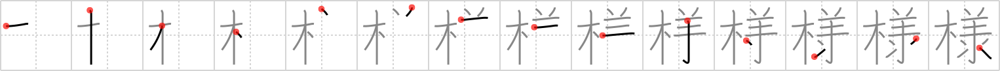

# {様}

## Strokes: 14

## Reading:

### On-Yomi: ヨウ、ショウ &mdash; Kun-Yomi: さま、さん

### Examples: 様 (さま)

## Words:

有様(ありさま): state, condition, circumstances, the way things are or should be, truth

一様(いちよう): uniformity, evenness, similarity, equality, impartiality

お蔭様で(おかげさまで): Thanks to god, thanks to you

ご苦労様(ごくろうさま): Thank you very much for your....

様(さま): Mr. or Mrs., manner, kind, appearance

左様なら(さようなら): good-bye

仕様(しよう): way, method, resource, remedy, (technical) specification

多様(たよう): diversity, variety

殿様(とのさま): feudal lord

様式(ようしき): style, form, pattern

様相(ようそう): aspect

王様(おうさま): king

神様(かみさま): god

逆様(さかさま): inversion, upside down

様々(さまざま): varied, various

同様(どうよう): identical, equal to, same (kind), like

模様(もよう): pattern, figure, design

様(よう): way, manner, kind, sort, appearance, like, such as, so as to, in order to, so that

様子(ようす): aspect, state, appearance
