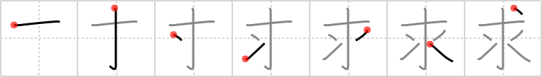

## `request`

## [7]

## Reading:

### On-Yomi: キュウ、グ &mdash; Kun-Yomi: もと.める

## Heisig V6:

Let the <i>drop</i> in the upper right-hand corner of this character close the right angle off to make an <i>arrowhead</i>. Whenever we find the <i>needle</i> with that <i>drop</i> in an element that has no other special meaning, we will take advantage of this primitive meaning. At the bottom, we see the <i>grains of rice</i>, the vertical line doubling up for the two elements. Do not confuse with <i>petition</i> (Frame 143).

## Koohii stories:

1) [<a href="http://kanji.koohii.com/profile/radical_tyro">radical_tyro</a>] 16-6-2007(221): Enemy: &quot;Any final<strong> request</strong>s?&quot; // MacGyver: &quot;Just an <em>arrowhead</em> and some <em>grains of rice</em>.&quot; (MacGyver then throws the <em>grains of rice</em> at the enemy and uses the <em>arrowhead</em> to cut his hands free from the rope.).

2) [<a href="http://kanji.koohii.com/profile/dingomick">dingomick</a>] 22-8-2007(134): <em>Robin Hood</em> holds his rich victim at <em>arrowpoint</em> and kindly <strong>request</strong>s that he hands over his <em>grains of rice</em>.

3) [<a href="http://kanji.koohii.com/profile/nagisa">nagisa</a>] 27-11-2007(52): A beggar asks for you if you can spare a few grains of rice, after you refuse you find him pointing an arrowhead at your throat. &quot;That wasn&#039;t a<strong> request</strong>.&quot;.

4) [<a href="http://kanji.koohii.com/profile/Danieru">Danieru</a>] 1-7-2008(39): For reasons I&#039;ll leave up to you, a monk is being put to death. &quot;Any last<strong> REQUEST</strong>S?&quot; they asked him, as they began to squirt <em>drops</em> of poison from a <em>needle</em> into the <em>water</em> of his intravenous line. Yet he said nothing, only concentrating on 求道 , <strong>seeking</strong> the path to enlightenment. (PLEASE note that the 部首 for this character is &quot;shitamizu&quot; - NOT rice, but <em>water</em>. Also, the keyword &quot;seek&quot; would be much more appropriate, and it is not used elsewhere in RTK. shrug).

5) [<a href="http://kanji.koohii.com/profile/kanjihito">kanjihito</a>] 12-6-2010(18): I don&#039;t<strong> request</strong> much, just <em>one</em> <em>drop</em> of those <em>rice grains</em>.

6) [<a href="http://kanji.koohii.com/profile/Perry">Perry</a>] 12-4-2010(17): Ghandi is on death row, and asked about his last meal. &quot;All I<strong> REQUEST</strong> is ONE GRAIN OF RICE and a DROP of water&quot;.

7) [<a href="http://kanji.koohii.com/profile/transalpin">transalpin</a>] 31-10-2008(11): Also means <strong>to seek</strong>: 十 <em>ten</em> 丶 <em>drops</em> of ⺢ <em>water</em>.

8) [<a href="http://kanji.koohii.com/profile/FutureBlues">FutureBlues</a>] 16-7-2008(10): Ever played a Legend of Zelda game? Think of the way you<strong> request</strong> help from the Great Faeries. You shoot an arrowhead into an <em>underground pool</em> (again, <em>shitamizu</em>, not rice...) and the Faerie appears and attempts to grant your<strong> request</strong>.

9) [<a href="http://kanji.koohii.com/profile/bennyb">bennyb</a>] 15-4-2009(7): In case anyone else has been as confused as me about the stroke order on this one (I think Heisig really should have included it in his book) <a href="http://www.yamasa.cc/members/ocjs/kanjidic.nsf/08f5b808586e291049256a54001552e9/c9383ceba2ae855d49256a90002ebf5e">http://www.yamasa.cc/members/ocjs/kanjidic.nsf/08f5b808586e291049256a54001552e9/c9383ceba2ae855d49256a90002ebf5e</a>!OpenDocument.

10) [<a href="http://kanji.koohii.com/profile/fuaburisu">fuaburisu</a>] 11-11-2005(6): On<strong> request</strong> (of the monk on the alms round) the top hat is filled with grains of rice, one grain is given back to the villager (tradition).
