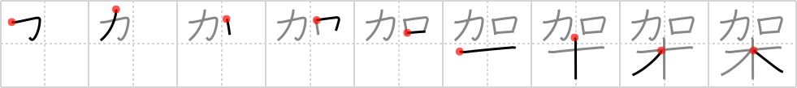

## `erect`

## [9]

## Reading:

### On-Yomi: カ &mdash; Kun-Yomi: か.ける、か.かる

## Heisig story:

<i>Add</i> . . . <i>trees</i>. Hint: if you ever <i>played with</i> an &quot;<b>Erector</b> Set&quot; or &quot;Tinker Toys&quot; as a child, don't pass up the opportunity to relate it to this kanji's key word and the element for <i>trees</i>.

## Koohii stories:

1) [<a href="http://kanji.koohii.com/profile/Stormchild">Stormchild</a>] 17-7-2006(261): Instant wood. Just add Viagra.

2) [<a href="http://kanji.koohii.com/profile/wrightak">wrightak</a>] 13-5-2006(180): I&#039;m not sure I know about<strong> erect</strong>or sets or tinker toys but I do know about jenga. You play by taking <em>wooden</em> pieces from the middle of a wooden tower and <em>add</em>ing them to the top. In this way you<strong> erect</strong> a very unstable structure.

3) [<a href="http://kanji.koohii.com/profile/ivoSF">ivoSF</a>] 12-7-2006(86): Powerfull mouth makes &quot;tree&quot; stand<strong> erect</strong>, hmm what does that mean?

4) [<a href="http://kanji.koohii.com/profile/RobMow">RobMow</a>] 26-8-2008(70): <em>Add wood</em> to<strong> erect</strong> a structure.

5) [<a href="http://kanji.koohii.com/profile/pazustep">pazustep</a>] 30-7-2008(36): To<strong> erect</strong> a building in Warcraft, you just keep <em>adding</em> more <em>wood</em>, until the building is fully<strong> erect</strong>ed.

6) [<a href="http://kanji.koohii.com/profile/Nisshawn">Nisshawn</a>] 16-10-2009(15): If a girl has a <em>power</em>ful <em>mouth</em> and its on your <em>wood</em> im sure you would instantly get<strong> erect</strong>.

7) [<a href="http://kanji.koohii.com/profile/ambassadog">ambassadog</a>] 1-5-2009(13): Wanna<strong> erect</strong> a <em>tree</em>house? Just <em>add</em> more <em>wood</em> to the top of a <em>tree</em>.

8) [<a href="http://kanji.koohii.com/profile/sethg">sethg</a>] 29-3-2009(12): Just <em>add</em> viagra and you&#039;ll be as<strong> erect</strong> as a <em>tree</em>!

9) [<a href="http://kanji.koohii.com/profile/blaked569">blaked569</a>] 3-7-2009(7): <em>Add</em> viagra and you get <em>wood</em>. Which is a euphemism for<strong> ERECT</strong> PENIS. Like a penis engorged with blood. boner.

10) [<a href="http://kanji.koohii.com/profile/fuaburisu">fuaburisu</a>] 10-10-2005(7): The Easter Island heads were<strong> erect</strong>ed, after they were moved on long distances with tree trunks. Hence, “erect with addition of trees”.

### {V4: 869, V6: 934}
