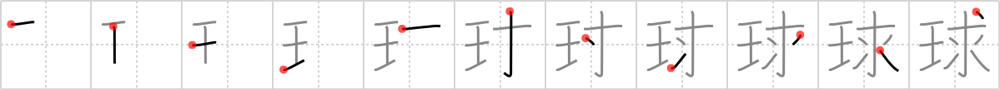

# {球}

## Strokes: 11

## Reading:

### On-Yomi: キュウ &mdash; Kun-Yomi: たま

### Examples: 球 (たま)

## Words:

眼球(がんきゅう): eyeball

球根(きゅうこん): (plant) bulb

球(きゅう): globe, sphere, ball

球(たま): globe, sphere, ball

地球(ちきゅう): the earth

電球(でんきゅう): light bulb
