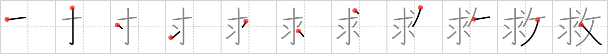

## {936}

## `salvation`

## [11]

## Reading:

### On-Yomi: キュウ &mdash; Kun-Yomi: すく.う

### Examples: 救う (すく.う)

## Words:

救援(きゅうえん): relief, rescue, reinforcement

救済(きゅうさい): relief, aid, rescue, salvation, help

救い(すくい): help, aid, relief

救助(きゅうじょ): relief, aid, rescue

救う(すくう): rescue from, help out of
