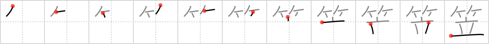

## `bamboo hat`

## [11]

## Reading:

### On-Yomi: リュウ &mdash; Kun-Yomi: かさ

## Heisig V6:

Bamboo . . . vase.

## Koohii stories:

1) [<a href="http://kanji.koohii.com/profile/smithsonian">smithsonian</a>] 30-1-2007(251): The <em>bamboo</em> <em>vase</em> was beautifully crafted, but the tourist didn&#039;t know what it was and wore it as a little<strong> bamboo hat</strong>.

2) [<a href="http://kanji.koohii.com/profile/broderickjeff">broderickjeff</a>] 29-1-2008(70): The <em>bamboo</em> part is easy. Just remember that this kanji refers to those particular <strong>bamboo hats</strong> that are worn primarily by Buddhist monks, who always seem to <em>stand</em> outside of train stations, collecting alms.

3) [<a href="http://kanji.koohii.com/profile/AndamanIslander">AndamanIslander</a>] 21-4-2008(53): Hey, where&#039;d you buy that<strong> bamboo hat</strong>? Over at that <em>bamboo stand</em>!

4) [<a href="http://kanji.koohii.com/profile/cjon256">cjon256</a>] 1-5-2009(24): Just cause you&#039;re <em>standing</em> with <em>bamboo</em> on your head, doesn&#039;t mean it&#039;s a<strong> bamboo hat</strong>!

5) [<a href="http://kanji.koohii.com/profile/Wosret">Wosret</a>] 14-2-2009(13): The<strong> Bamboo hat</strong>, <strong>stands</strong> on your head.

6) [<a href="http://kanji.koohii.com/profile/fuaburisu">fuaburisu</a>] 11-11-2005(10): <strong>Bamboo hat</strong> used like a vase (upside down).

7) [<a href="http://kanji.koohii.com/profile/jabberwockychortles">jabberwockychortles</a>] 8-4-2009(7): The <em>bamboo</em> is on the top of the person <em>standing</em>--it&#039;s a<strong> bamboo hat</strong>.

8) [<a href="http://kanji.koohii.com/profile/pageturner1988">pageturner1988</a>] 13-1-2008(6): My<strong> bamboo hat</strong> also doubles as a cover for my vase.

9) [<a href="http://kanji.koohii.com/profile/Gaignun">Gaignun</a>] 3-7-2010(4): A tourist purchases a <strong>bamboo hat</strong> in East Asia thinking it&#039;s a <em>bamboo</em> <em>vase</em>. Imagine the tourist turning one of these things upside down and growing plants out of them -- plants such as, oh I don&#039;t know, <em>bamboo</em>. <a href="http://en.wikipedia.org/wiki/Conical_Asian_hat">http://en.wikipedia.org/wiki/Conical_Asian_hat</a>.

10) [<a href="http://kanji.koohii.com/profile/b0ng0">b0ng0</a>] 24-1-2009(3): If you have a<strong> bamboo hat</strong> then you can <em>stand</em> outside in the rain.
