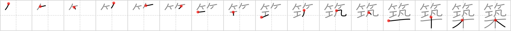

# {950}

## `fabricate`

## [16]

## Reading:

### On-Yomi: チク &mdash; Kun-Yomi: きず.く

### Examples: 築く (きず.く)

## Words:

築く(きずく): to build, to pile up, to amass

新築(しんちく): new building, new construction

建築(けんちく): construction, architecture
