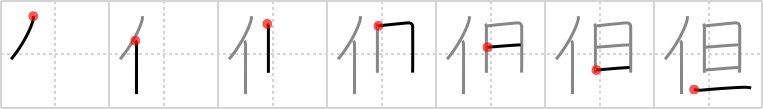

## `however`

## [7]

## Reading:

### On-Yomi: タン &mdash; Kun-Yomi: ただ.し

### Examples: 但し (ただ.し)

## Words:

但し(ただし): but, however, provided that

## Koohii stories:

1) [<a href="http://kanji.koohii.com/profile/fuaburisu">fuaburisu</a>] 27-11-2008(168): <strong>However</strong> drunk Mr T is when he comes back to his place, he always get up at nightbreak. “I pity da foo who gets up after nightbreak !”, says Mr. T. 

2) [<a href="http://kanji.koohii.com/profile/etpan">etpan</a>] 15-10-2008(59): Most people go to bed at <em>nightbreak</em>.<strong> However</strong>, <em>Chuck Norris</em> does not. He does not sleep, he waits. 

3) [<a href="http://kanji.koohii.com/profile/Howdoken">Howdoken</a>] 17-3-2008(41): <em>MR.T</em> leads a busy life,<strong> however</strong> he always makes sure to be in bed by <em>NIGHTBREAK</em>,<strong> however</strong> much he might want to stay up watching A-Team re-runs. 

4) [<a href="http://kanji.koohii.com/profile/Verdana">Verdana</a>] 26-5-2009(21): <em>Khatzumoto</em> says you should learn Japanese<strong> however</strong> you want, but you must have fun with it every day until <em>nightbreak</em>. 

5) [<a href="http://kanji.koohii.com/profile/liosama">liosama</a>] 18-1-2009(18): <strong>However</strong> many times i try to look at this kanji in review i realize how abstract the term &quot;however is&quot;. But i remember this story i made up just now which is a poor person until night break trying to remember this kanji. 

6) [<a href="http://kanji.koohii.com/profile/chamcham">chamcham</a>] 9-5-2007(16): <strong>However</strong> people are at nightbreak, don&#039;t expect the same attitude from them the rest of the day. 

7) [<a href="http://kanji.koohii.com/profile/uberclimber">uberclimber</a>] 20-3-2011(13): Jedi prefer the daylight; <em>Sith</em>,<strong> however</strong>, do their best work after <em>nightbreak</em>.   <a href="http://jisho.org/kanji/details/但し">但し</a>   (ただし) : but,<strong> however</strong>, provided that. 

8) [<a href="http://kanji.koohii.com/profile/Kambei">Kambei</a>] 7-7-2009(10): (THX akahige &amp; liosama)<strong> However</strong> is a very abstract term.<strong> However</strong> can we learn such an abstract term?<strong> However</strong> did <em>Mr. T</em> learn this kanji before <em>nightbreak</em>? And <strong>how</strong> did <em>Mr. T</em> climb Mt. <strong>Ever</strong>est before <em>nightbreak</em>?   <a href="http://jisho.org/kanji/details/但し">但し</a>   (ただし) but,<strong> however</strong>. 

9) [<a href="http://kanji.koohii.com/profile/penot">penot</a>] 28-10-2008(9): ただ·し/However, the world will end if <em><strong>Haruhi</strong></em> doesn&#039;t snap out of it before <em><strong>night break</strong></em>! //ただ·し=but/however// タン dan4 단 (dan). 

10) [<a href="http://kanji.koohii.com/profile/DrJones">DrJones</a>] 31-12-2007(9): <em>Dracula</em> is a very scary monster.<strong> However</strong>, he has to return to his coffin before <em>nightbreak</em> or he will turn into dust. 
