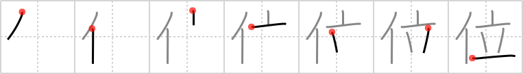

## `rank`

## [7]

## Reading:

### On-Yomi: イ &mdash; Kun-Yomi: くらい、ぐらい

## Heisig V6:

Person . . . vase.

## Koohii stories:

1) [<a href="http://kanji.koohii.com/profile/fuaburisu">fuaburisu</a>] 10-10-2005(121): Mr T<strong> rank</strong>s first position in the stand-up competition (doing knee flexions). Just picture him doing hundreds of these while the rest of the participants are already completely exhausted after a mere hundred.

2) [<a href="http://kanji.koohii.com/profile/cjon256">cjon256</a>] 1-5-2009(111): <strong>Rank</strong> A <em>person</em>&#039;s <em>stand</em>ing.

3) [<a href="http://kanji.koohii.com/profile/dwhitman">dwhitman</a>] 19-11-2007(45): <em>Mr. T</em><strong> rank</strong>s high with the ladies because his...ahem...is always <em>standing up</em>. &quot;I pity da poor fool whose tool be lying down on the job.&quot;.

4) [<a href="http://kanji.koohii.com/profile/eatyoda">eatyoda</a>] 30-9-2008(36): <em>Mr. T</em><strong> rank</strong>ed number one in the &quot;last man <em>standing</em>&quot; boxing tournament. You can imagine <em>Mr. T</em> <em>standing</em> atop all his fallen rivals to exemplify his top<strong> rank</strong>ing.

5) [<a href="http://kanji.koohii.com/profile/Transtic">Transtic</a>] 16-6-2008(15): In martial arts, you reach the highest<strong> RANK</strong> if you can <strong>stand</strong> against a <strong>roundhouse kick</strong> from <strong>Chuck Norris</strong> (person). Unfortunately, when <strong>Chuck Norris</strong> performs a <strong>roundhouse kick</strong>, the only one that is left <strong>standing</strong> is <strong>Chuck Norris</strong>.

6) [<a href="http://kanji.koohii.com/profile/uberclimber">uberclimber</a>] 20-3-2011(10): A <em>Jedi</em>&#039;s <em>stand</em>ing on the council is determined by his<strong> rank</strong>: padawan, knight, or Master. 位置 (いち) : location, position; 位 (くらい) : grade,<strong> rank</strong>, court order, dignity, nobility, situation, throne, crown, occupying a position, about, almost, as, rather, at least, enough to.

7) [<a href="http://kanji.koohii.com/profile/ars3nal">ars3nal</a>] 22-11-2009(9): In the military, when a <em>person</em> of higher<strong> rank</strong> enters the room, you have to <em>stand</em> up.

8) [<a href="http://kanji.koohii.com/profile/mattimus">mattimus</a>] 2-10-2009(6): Mr. T is at an art gallery<strong> rank</strong>ing his favorite Ming Dynasty vases. Pinning a ribbon on his favorite: &quot;I pity da foo who don&#039;t<strong> rank</strong> highly the anthropological significance of this floral vessel, artistic merits notwithstanding. Also, don&#039;t drink and drive sucka!&quot;.

9) [<a href="http://kanji.koohii.com/profile/plumage">plumage</a>] 23-3-2009(6): OBAMA STANDS at the highest<strong> RANK</strong> in our land.

10) [<a href="http://kanji.koohii.com/profile/Viking101">Viking101</a>] 3-1-2010(5): <em>Dwight Schrute</em> is preparing to receive his new karate<strong> rank</strong> when Michael Scott hits him with a <em>vase</em> from behind. Michael rejoices at being the victor but everyone else is appalled.
