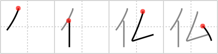

# {964}

## `Buddha`

## [4]

## Reading:

### On-Yomi: ブツ、フツ &mdash; Kun-Yomi: ほとけ

### Examples: 仏 (ほとけ)

## Words:

仏(ふつ): French

仏像(ぶつぞう): Buddhist image (statue)

仏(ほとけ): Buddha, merciful person, Buddhist image, the dead
