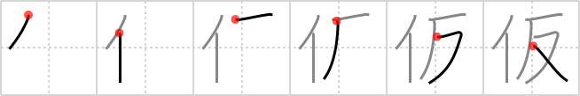

# {966}

## `provisional`

## [6]

## Reading:

### On-Yomi: カ、ケ &mdash; Kun-Yomi: かり、かり-

### Examples: 仮面 (かめん), 仮定 (かてい), 仮装 (かそう), 仮 (かり)

## Words:

仮(か): tentative, provisional

仮令(たとえ): example, even if, if, though, although

送り仮名(おくりがな): kana written after a kanji to complete the full (usually kun) reading of the word

仮定(かてい): assumption, supposition, hypothesis

仮名(かな): kana, alias, pseudonym, pen name

仮名遣い(かなづかい): kana orthography, syllabary spelling

振り仮名(ふりがな): hiragana over kanji, pronunciation key

片仮名(かたかな): katakana

平仮名(ひらがな): hiragana, 47 syllables, the cursive syllabary
