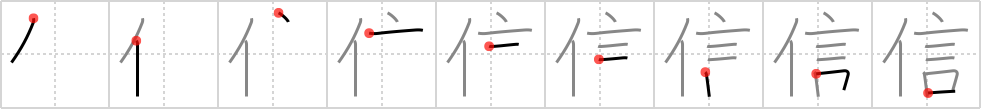

## {969}

## `faith`

## [9]

## Reading:

### On-Yomi: シン

## Words:

確信(かくしん): conviction, confidence

自信(じしん): self-confidence

信者(しんじゃ): believer, adherent, devotee, Christian

信任(しんにん): trust, confidence, credence

信用(しんよう): confidence, dependence, credit, faith, reliance, belief, credence

信仰(しんこう): (religious) faith, belief, creed

信号(しんごう): traffic lights, signal, semaphore

信じる(しんじる): believe, believe in, place trust in, confide in, have faith in

信ずる(しんずる): believe, believe in, place trust in, confide in, have faith in

信頼(しんらい): reliance, trust, confidence

通信(つうしん): correspondence, communication, news, signal

迷信(めいしん): superstition
