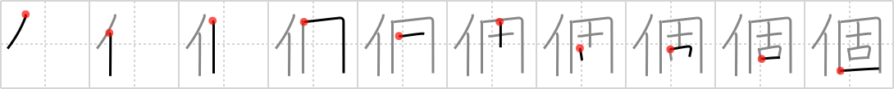

# {個}

## Strokes: 10

## Reading:

### On-Yomi: コ、カ

## Words:

個(か): article counter

個々(ここ): individual, one by one

個性(こせい): individuality, personality, idiosyncrasy

個別(こべつ): particular case

個所(かしょ): passage, place, point, part

個人(こじん): individual, personal, private

個体(こたい): an individual
