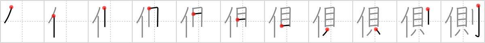

## `side`

## [11]

## Reading:

### On-Yomi: ソク &mdash; Kun-Yomi: かわ、がわ、そば

## Koohii stories:

1) [<a href="http://kanji.koohii.com/profile/nilfisq">nilfisq</a>] 12-9-2007(185): <em>Mr. T rulezzz</em>! I am on his<strong> side</strong>! 

2) [<a href="http://kanji.koohii.com/profile/amthomas">amthomas</a>] 21-3-2007(38): <em>Chuck Norris</em>&#039;s <em>rules</em> are easy to live by, just be on his<strong> side</strong>. 

3) [<a href="http://kanji.koohii.com/profile/CharleyGarrett">CharleyGarrett</a>] 17-12-2006(29): &quot;<strong>Mr. T</strong> got one <strong>rule</strong>!&quot; says <strong>Mr. T</strong>. &quot;I&#039;m on the <em>side</em> of those picked on by the bullies. I pity da foo who tries to bully those smaller than he is!&quot;. 

4) [<a href="http://kanji.koohii.com/profile/somukeru">somukeru</a>] 6-3-2008(23): There is the dark<strong> side</strong> and the <em>Jedi</em><strong> side</strong>. Those on the <em>Jedi</em><strong> side</strong> follows the <em>rules</em>. 

5) [<a href="http://kanji.koohii.com/profile/cescoz">cescoz</a>] 24-7-2009(15): A PERSON that follow your RULES is at your<strong> side</strong>. 

6) [<a href="http://kanji.koohii.com/profile/genbaku">genbaku</a>] 12-1-2008(12): Mr T has his &quot;rules&quot; tattooed to his<strong> side</strong>. 

7) [<a href="http://kanji.koohii.com/profile/dshill99">dshill99</a>] 30-7-2008(9): A <em>person</em> must live by the <em>rules</em> to be on the right<strong> SIDE</strong> of the law. 

8) [<a href="http://kanji.koohii.com/profile/sir_sanuk">sir_sanuk</a>] 5-1-2011(8): <em>Mr.T</em>: &quot;If you&#039;re on my<strong> side</strong>, you&#039;d better follow my <em>rules</em>&quot;. 

9) [<a href="http://kanji.koohii.com/profile/penot">penot</a>] 28-10-2008(6): Only those who follow <em>Haruhi</em>&#039;s <em>rules</em> can join her<strong> side</strong>. // <strong>がわ、 そば</strong> // ソク ce4 측 (cheug). 

10) [<a href="http://kanji.koohii.com/profile/brian44">brian44</a>] 19-11-2007(6): Does this get any easier...<em>people</em> have to turn the <em>shellfish</em> on its<strong> side</strong> in order to cut it open with a <em>saber</em> Or just think of it like, &quot;the <em>rule</em> is that all <em>people</em> have to be<strong> side</strong> by<strong> side</strong>. 
