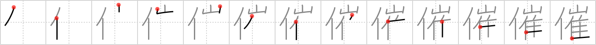

# {催}

## `sponsor`

## Strokes: 13

## Reading:

### On-Yomi: サイ &mdash; Kun-Yomi: もよう.す、もよお.す

### Examples: 催す (もよお.す)

## Words:

開催(かいさい): holding a meeting, open an exhibition

主催(しゅさい): organization, sponsorship

催す(もよおす): to hold (a meeting), to give (a dinner), to feel, to show signs of, to develop symptoms of, to feel (sick)

催促(さいそく): request, demand, claim, urge (action), press for

催し(もよおし): event, festivities, function, social gathering, auspices, opening, holding (a meeting)
