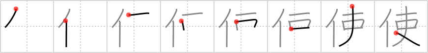

# {使}

## `use`

## Strokes: 8

## Reading:

### On-Yomi: シ &mdash; Kun-Yomi: つか.う、つか.い、-つか.い、-づか.い

### Examples: 使う (つか.う)

## Words:

お使い(おつかい): errand

使命(しめい): mission, errand, message

使用人(しようにん): employee, servant

使い道(つかいみち): use

使用(しよう): use, employment

大使(たいし): ambassador

大使館(たいしかん): embassy

使う(つかう): use, handle, manipulate, employ, need, want, spend, consume, speak (English), practise (fencing), take (one´s lunch), circulate (bad money)
