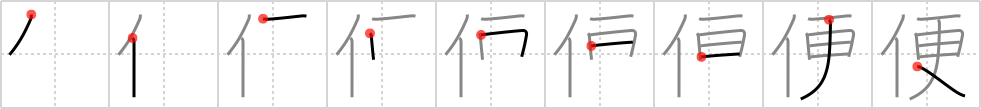

# {991}

## `convenience`

## [9]

## Reading:

### On-Yomi: ベン、ビン &mdash; Kun-Yomi: たよ.り

### Examples: 便利 (べんり), 便法 (べんぽう), 簡便 (かんべん), 便り (たよ.り)

## Words:

大便(だいべん): feces, excrement, shit

不便(ふびん): pity, compassion

便宜(べんぎ): convenience, accommodation, advantage, expedience

小便(しょうべん): (colloquial) urine

便り(たより): news, tidings, information, correspondence, letter

便(びん): mail, post, flight (e.g. airline flight), service, opportunity, chance, letter

便箋(びんせん): writing paper, stationery

船便(ふなびん): surface mail (ship)

便所(べんじょ): toilet, lavatory, rest room, latrine

郵便(ゆうびん): mail, postal service

不便(ふべん): inconvenience

便利(べんり): convenient, handy, useful

郵便局(ゆうびんきょく): post office
