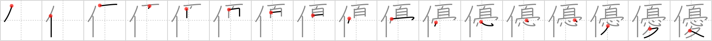

## {993}

## `tenderness`

## [17]

## Reading:

### On-Yomi: ユウ、ウ &mdash; Kun-Yomi: やさ.しい、すぐ.れる、まさ.る

### Examples: 優れる (すぐ.れる), 優しい (やさ.しい)

## Words:

俳優(はいゆう): actor, actress, player, performer

優(やさ): gentle, affectionate

優位(ゆうい): predominance, ascendancy, superiority

優越(ゆうえつ): supremacy, predominance, being superior to

優勢(ゆうせい): superiority, superior power, predominance, preponderance

優先(ゆうせん): preference, priority

優美(ゆうび): grace, refinement, elegance

女優(じょゆう): actress

優れる(すぐれる): surpass, outstrip, excel

優秀(ゆうしゅう): superiority, excellence

優勝(ゆうしょう): overall victory, championship

優しい(やさしい): kind
