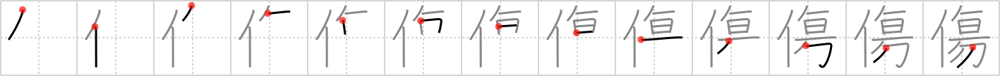

# {傷}

## Strokes: 13

## Reading:

### On-Yomi: ショウ &mdash; Kun-Yomi: きず、いた.む、いた.める

### Examples: 傷む (いた.む), 傷める (いた.める), 傷 (きず)

## Words:

火傷(かしょう): burn, scald

傷付く(きずつく): to be hurt, to be wounded, to get injured

傷(しょう): wound, injury, hurt, cut, gash, bruise, scratch, scar, weak point

中傷(ちゅうしょう): slander, libel, defamation

負傷(ふしょう): injury, wound

傷(きず): wound, injury, hurt, cut, gash, bruise, scratch, scar, weak point

火傷(やけど): burn, scald
