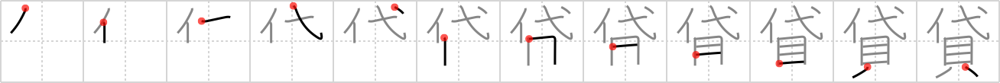

## `lend`

## [12]

## Reading:

### On-Yomi: タイ &mdash; Kun-Yomi: か.す、か.し-、かし-

### Examples: 貸す (か.す)

## Words:

貸し(かし): loan, lending

貸し出し(かしだし): lending, loaning

貸間(かしま): room to let

貸家(かしや): house for rent

貸す(かす): lend

## Koohii stories:

1) [<a href="http://kanji.koohii.com/profile/Matthew">Matthew</a>] 21-1-2007(266): In order for the bank to<strong> lend</strong> you <em>money</em>, you need to put up some sort of collateral as a <em>substitute</em> for the <em>money</em>. 

2) [<a href="http://kanji.koohii.com/profile/Zactacular">Zactacular</a>] 3-10-2007(65): The poor <em>substitute</em> teacher asks the class to<strong> lend</strong> him some <em>money</em> for the bus fare home. 

3) [<a href="http://kanji.koohii.com/profile/dihutenosa">dihutenosa</a>] 7-9-2007(21): Flash back a second...<em>Mr T</em> is still your <em>substitute</em> teacher. You realize you didn&#039;t bring any shells for lunch, and you ask your friend to<strong> lend</strong> you some <em>shells</em> for lunch money. He refuses, and you feel a bit embarrassed. <em>Mr T</em> quietly reaches into a sack (which they will cart him away on later) and discreetly hands it to you. &quot;I&#039;m just<strong> lend</strong>ing it to ya, foo! Stop that thanking jibba jabba.&quot; [trigger:<strong> lend</strong> me some lunch money]. 

4) [<a href="http://kanji.koohii.com/profile/fuaburisu">fuaburisu</a>] 28-10-2005(17): I pictured the &quot;<em>substitute shells</em>&quot; as semi-transparent, or ghostly money, symbolising how they only stand for money that you didn&#039;t have in the first place. -- &quot;lended <em>shells</em> are <em>substitute shells</em>&quot;. 

5) [<a href="http://kanji.koohii.com/profile/robertmyers">robertmyers</a>] 23-11-2011(13): When you<strong> lend</strong> money to someone, you are in essence substituting their money (or lack there of) with yours. 

6) [<a href="http://kanji.koohii.com/profile/Thunderball">Thunderball</a>] 4-9-2008(8): I always ask for some kind of a <em>substitute</em> when I<strong> lend</strong> <em>money</em> - e.g. an I.O.U note or something of the sort. 

7) [<a href="http://kanji.koohii.com/profile/captal">captal</a>] 27-4-2008(6): A bank<strong> lend</strong>s to you because you have collateral- which is a <strong>substitute</strong> for the <strong>money</strong> they lent you. 

8) [<a href="http://kanji.koohii.com/profile/tritonxg">tritonxg</a>] 12-2-2010(5): [FR]<strong>prêter</strong> japlt:N3 <strong>TAI ka(su/shi)</strong> kanji&amp;kana:748 <em>substituer+coquillage-monnaie </em><strong>prêter sur gage :</strong> le gage se SUBSTITUE au débiteur s&#039;il ne peut rembourser la MONNAIE qui a été PRETEE   <a href="http://jisho.org/kanji/details/貸しつける">貸しつける</a>  【かしつける】<strong> lend</strong>貸しボート【かしボート】hire boat  <a href="http://jisho.org/kanji/details/貸し家">貸し家</a>  【かしや】house for rent  <a href="http://jisho.org/kanji/details/貸金">貸金</a>  【かしきん】loan  <a href="http://jisho.org/kanji/details/先貸し">先貸し</a>  【さきがし】payment in advance  <a href="http://jisho.org/kanji/details/不良貸し付け">不良貸し付け</a>  【ふりょうかしつけ】bad debts  <a href="http://jisho.org/kanji/details/貸切り">貸切り</a>  【かしきり】reservation. 

9) [<a href="http://kanji.koohii.com/profile/gavmck">gavmck</a>] 9-12-2009(4): This kanji is like a credit card - a <em>substitute</em> for <em>shells/money</em>. The card company<strong> lend</strong>s you shells with the understanding that you pay back later. 

10) [<a href="http://kanji.koohii.com/profile/radical_tyro">radical_tyro</a>] 17-6-2007(4): If Mr. T is the <em>substitute</em> teacher, he will always<strong> lend</strong> you some <em>money</em> cause he has so much of it. 
