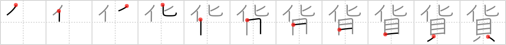

## `freight`

## [11]

## Reading:

### On-Yomi: カ &mdash; Kun-Yomi: たから

## Words:

外貨(がいか): imported goods, foreign money

貨幣(かへい): money, currency, coinage

雑貨(ざっか): miscellaneous goods, general goods, sundries

貨物(かもつ): cargo, freight, money or assets

硬貨(こうか): coin

通貨(つうか): currency

## Koohii stories:

1) [<a href="http://kanji.koohii.com/profile/mcfate">mcfate</a>] 14-2-2008(185): <strong>Freight</strong> is the <em>shells</em> (money) paid to <em>change</em> the location of something big. Don&#039;t confuse with the similar   <a href="http://jisho.org/kanji/details/賃">賃</a>   <a href="../1004">fare</a> (#1004 <a href="http://jisho.org/kanji/details/賃">賃</a>). 

2) [<a href="http://kanji.koohii.com/profile/dihutenosa">dihutenosa</a>] 7-9-2007(97): This is a<strong> freight</strong> train that runs on <em>spare change</em>. Imagine getting on the<strong> freight</strong> train with a bunch of <em>spare change</em>. You put in some <em>change</em> and it starts up...goes for a few minutes, then starts to slow down. You look at the slot..there&#039;s actually a slot for <em>spare change</em> and one for regular <em>shells</em>. Your call, but it seems to prefer <em>spare change</em> over <em>shells</em>. 

3) [<a href="http://kanji.koohii.com/profile/ruisu">ruisu</a>] 17-11-2007(46): Countries like to <em>change</em> <em>money</em> by trading<strong> freight</strong>. 

4) [<a href="http://kanji.koohii.com/profile/herman">herman</a>] 20-3-2009(36): This is also commonly used to mean currency, which is easier to remember given the kanji I think. When you travel abroad you change your clams into the local currency. Easy breezy. 

5) [<a href="http://kanji.koohii.com/profile/Neobeo">Neobeo</a>] 13-12-2008(13): You catch the<strong> freight</strong> train, but suddenly realise you did not bring enough <em>money</em>. You turn out your pockets to show the inspector that you have nothing but spare <em>change</em>. 

6) [<a href="http://kanji.koohii.com/profile/Skinny">Skinny</a>] 29-3-2009(11): A<strong> freight</strong> train that changes (transformers-style) into a shellfish. 

7) [<a href="http://kanji.koohii.com/profile/Teskal">Teskal</a>] 10-4-2009(8): German: Wenn die <strong>Fracht</strong> nicht schnell das Ziel erreicht, wird sie sich in etwas stinkendes <em>verwandeln</em> und kein <em>Geld</em> mehr einbringen. 

8) [<a href="http://kanji.koohii.com/profile/tryllid">tryllid</a>] 23-7-2008(6): Change + Shellfish (Money): The<strong> freight</strong> (money charged) for shipping anything changes based on the cost of gasoline. 

9) [<a href="http://kanji.koohii.com/profile/Immacolata">Immacolata</a>] 18-2-2006(6): Mr T and the spoon oracle sits in a<strong> freight</strong> car on the run from the evil Matrix robots. They are sitting on a pile of clamshells, very smelly, but hobos cant be chosers. 

10) [<a href="http://kanji.koohii.com/profile/Haych">Haych</a>] 23-10-2008(5): You always see trains carrying<strong> freight</strong>.. but what happens when their goods reach their destination? Perhaps they ex<em>change</em> that<strong> freight</strong> for the same weight in <em>shells</em> and haul that back. 
