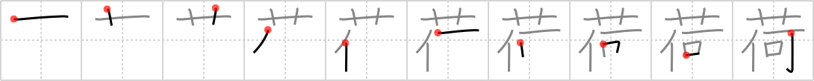

# {荷}

## `baggage`

## Strokes: 10

## Reading:

### On-Yomi: カ &mdash; Kun-Yomi: に

### Examples: 荷 (に)

## Words:

荷(に): load, baggage, cargo

荷造り(にづくり): packing, baling, crating

荷物(にもつ): baggage, luggage
